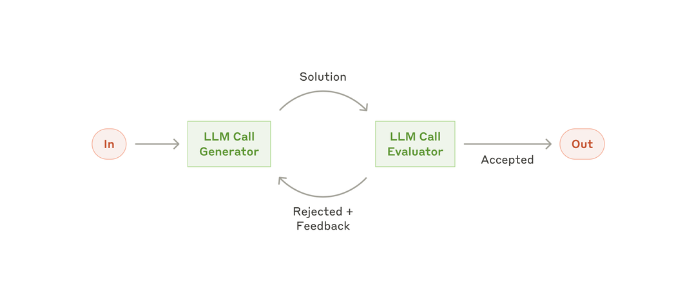
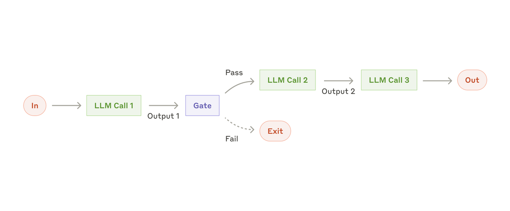
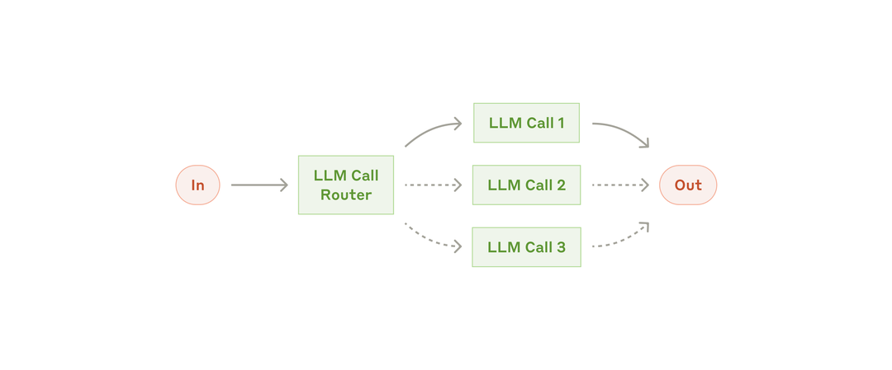
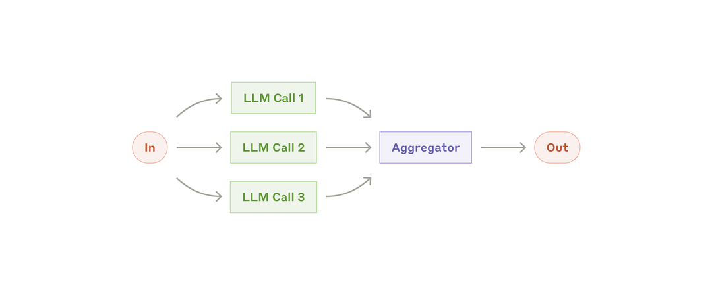
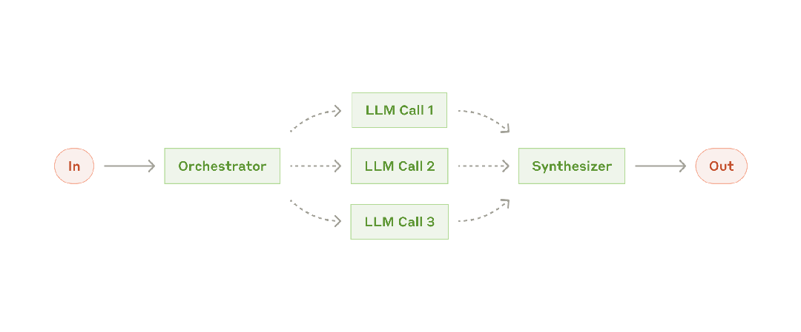
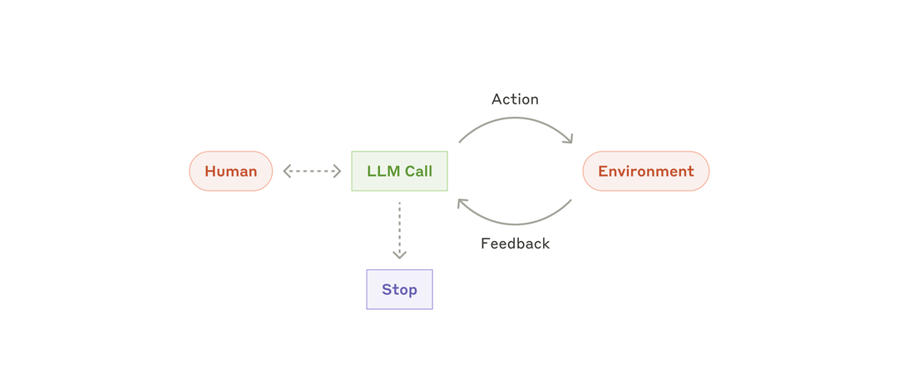
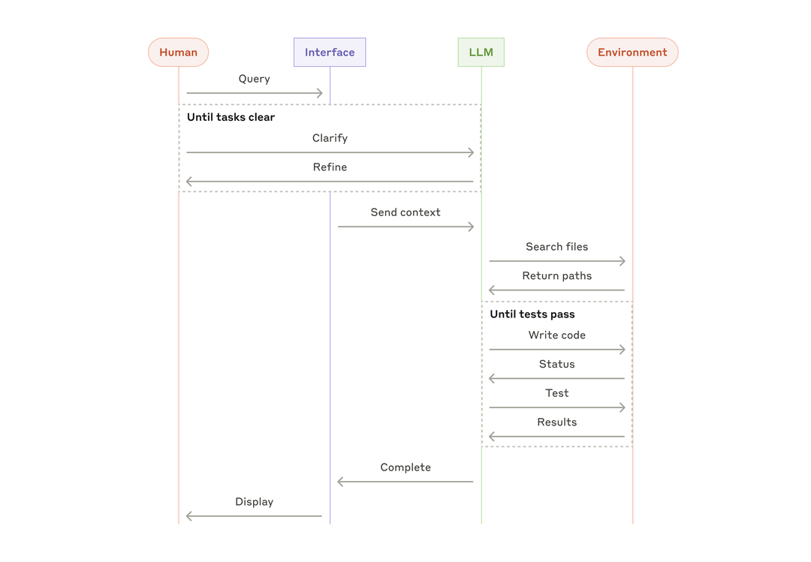

# 构建有效的Agent

> 原文：[Building effective agents](https://www.anthropic.com/engineering/building-effective-agents)
> 来源：Anthropic Engineering | 2024-12-19
> 作者：Erik S. & Barry Zhang

---

## 索引

- [什么是Agent？](#什么是agent)
- [何时使用（何时不用）Agent](#何时使用何时不用agent)
- [何时以及如何使用框架](#何时以及如何使用框架)
- [构建模块、工作流与Agent](#构建模块工作流与agent)
  - [构建模块：增强型LLM](#构建模块增强型llm)
  - [工作流：Prompt链](#工作流prompt链)
  - [工作流：路由](#工作流路由)
  - [工作流：并行化](#工作流并行化)
  - [工作流：编排者-工人](#工作流编排者-工人)
  - [工作流：评估者-优化者](#工作流评估者-优化者)
  - [Agent](#agent)
- [组合与定制这些模式](#组合与定制这些模式)
- [附录1：Agent实践案例](#附录1agent实践案例)
- [附录2：为工具做Prompt Engineering](#附录2为工具做prompt-engineering)

---

## 什么是Agent？

过去一年，我们与数十个跨行业团队合作构建 LLM agent。一个一致的发现是：**最成功的实现不用复杂框架或专用库，而是用简单、可组合的模式。**

下面是我们从客户合作和自身 agent 构建中学到的经验，为开发者提供实用建议。

---

"Agent"的定义因人而异。有些客户说的 agent 是完全自主的系统——长时间独立运行，调用各种工具完成复杂任务。另一些人说的是更受控的实现——按预定义工作流执行。在 Anthropic，我们把这些变体统称为 **agentic 系统**，但在架构上做了一个关键区分：

- **工作流（Workflows）**：用预定义的代码路径编排 LLM 和工具。
- **Agent**：LLM 自己决定流程和工具调用方式，掌握任务的控制权。

---

## 何时使用（何时不用）Agent

构建 LLM 应用时，我们建议**找到最简单的可行方案**，只在必要时增加复杂度。很多时候根本不需要构建 agentic 系统。

Agentic 系统通常用**延迟和成本换取更好的任务表现**，你需要考虑这个权衡何时合理：

- 对于定义明确的任务，**工作流**提供可预测性和一致性
- 当需要灵活性和模型驱动的决策时，**Agent** 是更好的选择
- 对于很多应用，**优化单次 LLM 调用**（配合检索和上下文示例）通常就够了

---

## 何时以及如何使用框架

市面上有很多框架可以简化 agentic 系统的搭建：Claude Agent SDK、AWS Strands Agents SDK、Rivet（拖拽式 GUI 工作流构建器）、Vellum（另一个 GUI 工具）。

这些框架帮你封装了底层琐事（调 LLM、定义和解析工具、串联调用），上手很快。但它们往往**多加了一层抽象，把底层的 prompt 和 response 藏起来了**，出了问题很难调试。它们还容易诱导你在简单方案就够用时添加不必要的复杂度。

我们建议开发者**从直接使用 LLM API 开始**：很多模式几行代码就能实现。如果你确实使用框架，确保你理解底层代码。对底层机制的错误假设是客户出错的常见原因。

---

## 构建模块、工作流与Agent

本节探索我们在生产环境中看到的 agentic 系统常见模式。从最基础的构建模块——增强型 LLM——开始，逐步增加复杂度，从简单的组合式工作流到自主 agent。

---

### 构建模块：增强型LLM

Agentic 系统的基本构建模块是一个**增强了检索、工具和记忆能力的 LLM**。当前模型能主动使用这些能力——自己生成搜索查询、选择合适的工具、决定保留什么信息。

*图：增强型LLM（The augmented LLM）*

实现时建议关注两个关键方面：

1. **为你的具体用例定制这些能力**
2. **确保它们为 LLM 提供简单、文档完善的接口**

实现增强的一种方式是通过 Model Context Protocol（MCP），开发者只需写一个简单的客户端，就能接入不断增长的第三方工具生态。

以下内容假设每次 LLM 调用都能访问这些增强能力。

---

### 工作流：Prompt链

Prompt 链将任务分解为一系列步骤，每次 LLM 调用处理上一步的输出。你可以在任何中间步骤添加程序化检查（"gate"），确保流程没有跑偏。

*图：Prompt链工作流（The prompt chaining workflow）*

**何时使用**：任务可以清晰地分解为固定的子任务。核心目标是**用延迟换取更高准确度**——让每次 LLM 调用只处理一个更简单的任务。

**示例**：
- 生成营销文案，然后翻译成另一种语言
- 写文档大纲，检查大纲是否满足标准，然后基于大纲写文档

---

### 工作流：路由

路由对输入进行分类，然后将其导向专门的后续处理。这个模式实现了**关注点分离**，让你能为每类输入构建更专门的 prompt。不做路由的话，为一类输入优化 prompt 往往会损害其他类型的表现。

*图：路由工作流（The routing workflow）*

**何时使用**：任务存在明确的类别，分开处理效果更好，且分类本身能做准确（用 LLM 或传统分类模型都行）。

**示例**：
- 不同类型的客服查询（一般问题、退款、技术支持）分流到不同的下游流程、prompt 和工具
- 简单/常见问题路由到小模型（如 Claude Haiku 4.5），困难/罕见问题路由到更强模型（如 Claude Sonnet 4.5）

---

### 工作流：并行化

LLM 有时可以同时处理一个任务的不同部分，然后程序化地聚合输出。并行化有两种关键变体：

- **分段（Sectioning）**：将任务拆分为独立子任务并行运行
- **投票（Voting）**：对同一任务运行多次以获得多样化输出

*图：并行化工作流（The parallelization workflow）*

**何时使用**：子任务可以并行化以提速，或需要多个视角/尝试来获得更高置信度。对于需要考虑多个维度的复杂任务，让每个维度由单独的 LLM 调用处理，通常比塞在一次调用里效果好。

**示例**：

分段：
- Guardrails——一个模型实例处理用户查询，另一个筛查不当内容。比让同一次 LLM 调用同时处理 guardrails 和核心响应效果更好。
- 自动化 eval——每个 LLM 调用评估模型在给定 prompt 上的不同方面表现。

投票：
- 代码漏洞审查——多个不同 prompt 审查代码，发现问题就标记。
- 内容审核——多个 prompt 评估不同方面，通过投票阈值平衡误报和漏报。

---

### 工作流：编排者-工人

在编排者-工人（Orchestrator-workers）工作流中，一个中央 LLM 动态分解任务、委派给工人 LLM、并综合它们的结果。

*图：编排者-工人工作流（The orchestrator-workers workflow）*

**何时使用**：复杂任务中你无法预测需要哪些子任务（例如编码中，需要修改的文件数量和每个文件的修改性质取决于具体任务）。它和并行化的拓扑结构类似，关键区别是**灵活性**——子任务不是预定义的，而是由编排者根据具体输入决定。

**示例**：
- 编码产品——每次要对多个文件做复杂修改
- 搜索任务——从多个来源收集和分析信息

---

### 工作流：评估者-优化者

在评估者-优化者（Evaluator-optimizer）工作流中，一个 LLM 调用生成响应，另一个在循环中提供评估和反馈。

*图：评估者-优化者工作流（The evaluator-optimizer workflow）*

**何时使用**：有明确的评估标准，且迭代改进能提供可衡量的价值。两个适用信号：第一，人给反馈后 LLM 的输出能明显改善；第二，LLM 自己也能提供这样的反馈。跟人类作者反复打磨文档是一个道理。

**示例**：
- 文学翻译——译者 LLM 第一遍可能漏掉一些细微差别，评估者 LLM 能指出来
- 复杂搜索——需要多轮搜索和分析才能收集全面信息，评估者决定要不要继续搜

---

### Agent

随着 LLM 在关键能力上逐渐成熟——理解复杂输入、推理和规划、可靠地使用工具、从错误中恢复——Agent 开始在生产环境中落地。

Agent 的起点是用户的命令或交互讨论。任务明确后，agent **独立规划和运行**，可能返回人类获取更多信息或判断。执行过程中，关键是 agent 在每一步从环境获取"ground truth"（如工具调用结果或代码执行）来评估进展。Agent 可以在检查点或遇到阻碍时暂停等待人类反馈。任务通常在完成时终止，但也常包含停止条件（如最大迭代次数）以保持控制。

Agent 能处理复杂任务，但**实现往往很直接**——通常只是 LLM 在循环中基于环境反馈使用工具。因此，清晰、周到地设计工具集及其文档至关重要。

*图：自主Agent（Autonomous agent）*

**何时使用**：开放式问题，无法预测所需步骤数，无法硬编码固定路径。LLM 可能运行很多轮，你必须对其决策有一定程度的信任。Agent 的自主性使其非常适合在受信环境中扩展任务。

自主性也意味着更高成本和错误累积的可能。我们建议在沙箱环境中进行广泛测试，配合适当的 guardrails。

**示例**（来自我们自己的实现）：
- 解决 SWE-bench 任务的 coding agent——根据任务描述编辑多个文件
- "computer use"参考实现——Claude 操作计算机完成任务

*图：Coding Agent高层流程（High-level flow of a coding agent）*

---

## 组合与定制这些模式

这些构建模块不是规定性的。它们是开发者可以塑造和组合以适应不同用例的常见模式。成功的关键——和所有 LLM 功能一样——是**衡量性能并迭代实现**。

再强调一遍：**只在复杂度能明显改善结果时才添加复杂度。**

LLM 领域的成功不在于构建最复杂的系统，而在于构建**适合你需求的正确系统**。从简单 prompt 开始，用全面的 eval 优化它们，只在简单方案不够时才添加多步 agentic 系统。

实现 agent 时，我们遵循三个核心原则：

1. 保持 agent 设计的**简单性**
2. 通过显式展示 agent 的规划步骤来优先保证**透明度**
3. 通过充分的工具文档和测试，精心打造 agent-计算机接口（ACI）

框架可以帮你快速起步，但走向生产时不要犹豫减少抽象层、用基础组件构建。

---

## 附录1：Agent实践案例

我们与客户的合作揭示了两个特别有前景的 AI agent 应用方向。它们的共性：需要对话和行动结合、有明确的成功标准、能形成反馈循环、人工监督能有效介入。

### A. 客户支持

客户支持将熟悉的聊天界面与工具集成的增强能力结合在一起。它天然适合开放式 agent，因为：

- 支持交互自然遵循对话流，同时需要访问外部信息和执行操作
- 工具可以集成来拉取客户数据、订单历史和知识库文章
- 退款、更新工单等操作可以程序化处理
- 成功可以通过用户定义的解决方案清晰衡量

多家公司通过"按成功解决收费"的定价模型证明了这种方法的可行性——敢这么收费，说明对自家 agent 的效果有信心。

### B. Coding Agent

软件开发领域展现了 LLM 的巨大潜力，能力从代码补全演进到自主问题解决。Agent 在这里特别有效，因为：

- 代码方案可通过自动化测试验证
- Agent 可以使用测试结果作为反馈来迭代方案
- 问题空间定义明确且结构化
- 输出质量可以客观衡量

在我们自己的实现中，agent 已经能仅凭 PR 描述解决 SWE-bench Verified 基准中的真实 GitHub issue。不过，自动化测试虽然能验证功能正确性，**人工审查对确保方案符合更广泛的系统需求仍然至关重要**。

---

## 附录2：为工具做Prompt Engineering

无论你构建哪种 agentic 系统，工具很可能是 agent 的重要组成部分。工具使 Claude 能通过在 API 中指定精确的结构和定义来与外部服务交互。

工具定义和规范应该得到**与整体 prompt 同等的 prompt engineering 关注**。

同一个操作通常有多种指定方式。例如，文件编辑可以通过写 diff 或重写整个文件来指定。结构化输出可以放在 markdown 或 JSON 中。从软件工程角度看这些差异是表面的，可以无损转换。但**某些格式对 LLM 来说比其他格式难写得多**：

- 写 diff 需要在新代码写出之前就知道 chunk header 中有多少行在变化
- 在 JSON 中写代码（相比 markdown）需要额外转义换行符和引号

**我们对工具格式的建议**：

1. 给模型足够的 token 来"思考"，避免它把自己写进死角
2. 保持格式接近模型在互联网文本中自然见到的形式
3. 确保没有格式"开销"——比如需要精确计数数千行代码，或对代码做字符串转义

一个经验法则：想想人机接口（HCI）投入了多少精力，计划对 **agent-计算机接口（ACI）** 投入同等精力。具体做法：

- **站在模型的角度想**。仅凭描述和参数，使用这个工具是否显而易见？如果你需要仔细思考，模型可能也是。好的工具定义通常包含使用示例、边界情况、输入格式要求，以及与其他工具的清晰边界。
- **参数名和描述能不能改得更直白？** 把它想象成为团队中的初级开发者写一个优秀的 docstring。使用很多相似工具时这点尤其重要。
- **测试模型如何使用你的工具**：在 workbench 中运行大量示例输入，看模型犯什么错误，然后迭代。
- **对工具做防呆设计（Poka-yoke）**：修改参数使犯错更难。

在构建 SWE-bench agent 时，我们实际上**花在优化工具上的时间比优化整体 prompt 更多**。例如，我们发现模型在 agent 移出根目录后会在使用相对文件路径的工具上犯错。解决办法是把工具改为始终要求绝对文件路径——改完之后模型再没犯过这个错。
