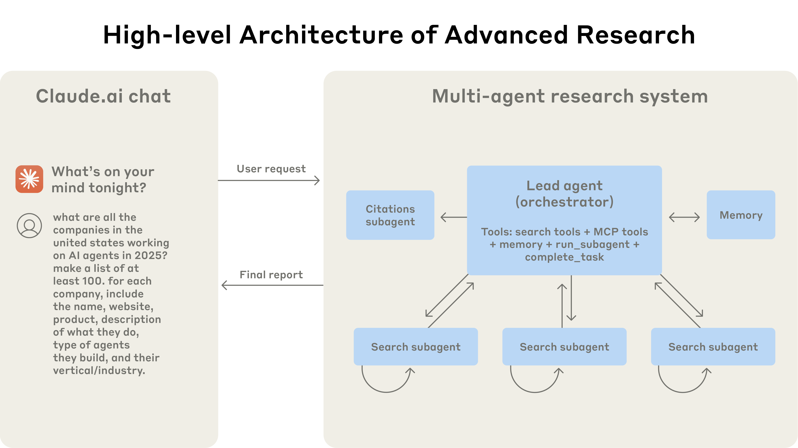
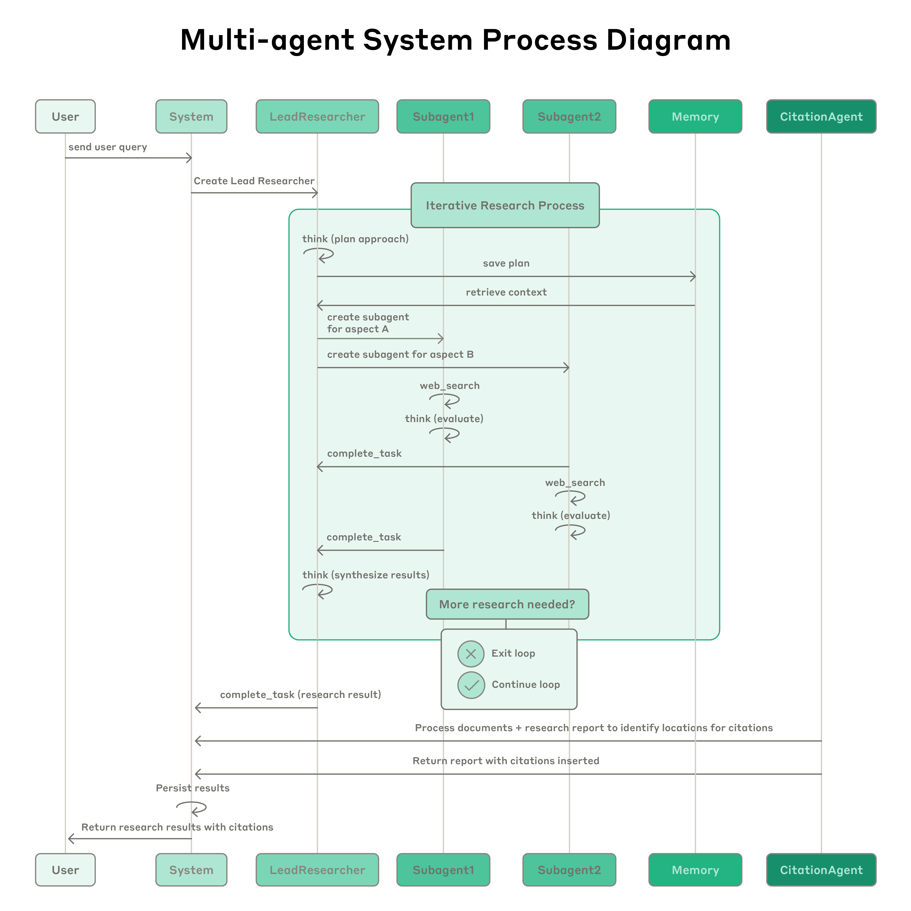
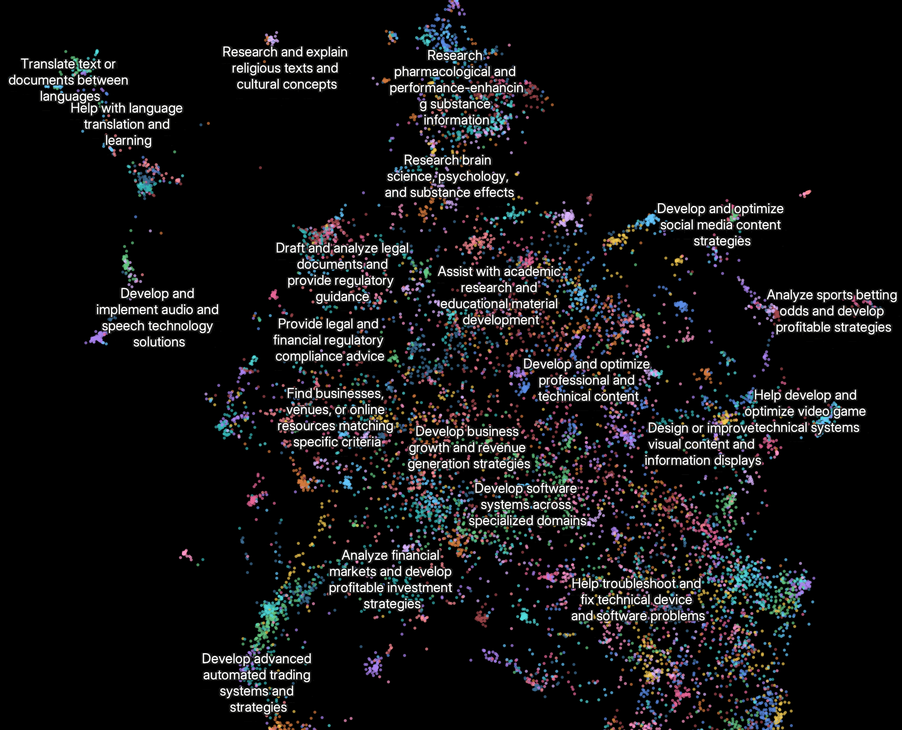

# 我们如何构建Multi-Agent研究系统

> 原文：[How we built our multi-agent research system](https://www.anthropic.com/engineering/multi-agent-research-system)
> 来源：Anthropic Engineering | 2025-06-13
> 作者：Jeremy Hadfield, Barry Zhang, Kenneth Lien, Florian Scholz, Jeremy Fox, Daniel Ford

---

## 索引

- [Multi-agent系统的优势](#multi-agent系统的优势)
- [Research的架构概览](#research的架构概览)
- [Prompt Engineering与评估](#prompt-engineering与评估)
- [Agent的有效评估](#agent的有效评估)
- [生产可靠性与工程挑战](#生产可靠性与工程挑战)
- [结论](#结论)
- [附录：额外技巧](#附录额外技巧)

---

这个multi-agent系统从原型到生产的过程教会了我们关于系统架构、工具设计和prompt engineering的关键教训。Multi-agent系统由多个agent（LLM在循环中自主使用工具）协同工作组成。我们的Research功能涉及一个agent根据用户查询规划研究过程，然后使用工具创建并行agent同时搜索信息。

多agent系统引入了agent协调、评估和可靠性方面的新挑战。

---

## Multi-agent系统的优势

研究工作涉及开放式问题，很难提前预测所需步骤。你无法为探索复杂主题硬编码固定路径——过程本质上是动态的、路径依赖的。人们做研究时，倾向于基于发现持续更新方法，追踪调查中涌现的线索。

这种不可预测性使AI agent特别适合研究任务。模型必须自主运行很多轮，基于中间发现决定追求哪些方向。线性的one-shot流水线无法处理这些任务。

**搜索的本质是压缩**：从庞大语料库中提炼洞察。Sub-agent通过在各自的context window中并行运行来促进压缩——同时探索问题的不同方面，然后为主研究agent浓缩最重要的token。每个sub-agent还提供关注点分离——不同的工具、prompt和探索轨迹——减少路径依赖，实现彻底、独立的调查。

### 性能数据

我们的内部评估显示，multi-agent研究系统在**广度优先查询**（同时追求多个独立方向）上尤其出色。以Claude Opus 4为主agent、Claude Sonnet 4为sub-agent的multi-agent系统，在内部研究eval上**比单agent Claude Opus 4高出90.2%**。

在BrowseComp评估中，三个因素解释了95%的性能方差：
- **Token使用量**本身解释80%的方差
- 工具调用次数
- 模型选择

这验证了我们将工作分布到具有独立context window的agent的架构。

### 代价

实践中，这些架构消耗token很快。Agent通常使用约**4×**于聊天交互的token，multi-agent系统使用约**15×**于聊天的token。经济可行性要求任务价值足够高。

Multi-agent系统擅长：重度并行化的高价值任务、超出单个context window的信息、与大量复杂工具交互。

---

## Research的架构概览

我们的Research系统使用**编排者-工人（orchestrator-worker）模式**的multi-agent架构，主agent协调过程，同时委派给并行运行的专门化sub-agent。

用户提交查询时，主agent分析它、制定策略、生成sub-agent同时探索不同方面。Sub-agent作为智能过滤器，迭代使用搜索工具收集信息，然后返回结果给主agent编译最终答案。

与传统RAG（静态检索相似chunk）不同，我们的架构使用**多步搜索**——动态发现相关信息、适应新发现、分析结果以形成高质量答案。

**完整流程**：
1. 用户提交查询 → 创建LeadResearcher agent
2. LeadResearcher思考方法并将计划保存到Memory（因为超过200K token时context会被截断）
3. 创建专门化Sub-agent（数量不定）执行具体研究任务
4. 每个Sub-agent独立执行网络搜索，用interleaved thinking评估工具结果
5. Sub-agent返回发现给LeadResearcher
6. LeadResearcher综合结果，决定是否需要更多研究
7. 信息充足后，传给CitationAgent处理引用
8. 返回带引用的最终研究结果

---

## Prompt Engineering与评估

Multi-agent系统与单agent系统有关键区别，包括协调复杂度的快速增长。早期agent犯的错误包括：为简单查询生成50个sub-agent、无休止地搜索不存在的来源、用过多更新互相干扰。

### 核心原则

**像你的agent一样思考。** 我们在Console中用系统的精确prompt和工具构建模拟，然后逐步观察agent工作。这立即揭示了失败模式：agent在已有足够结果时继续搜索、使用过于冗长的搜索查询、选择错误的工具。

**教编排者如何委派。** 主agent将查询分解为子任务并描述给sub-agent。每个sub-agent需要：目标、输出格式、工具和来源指导、清晰的任务边界。没有详细任务描述时，agent会重复工作、留下空白、或找不到必要信息。

**按查询复杂度缩放努力。** Agent难以判断不同任务的适当努力程度，所以我们在prompt中嵌入了缩放规则：
- 简单事实查找：1个agent，3-10次工具调用
- 直接比较：2-4个sub-agent，每个10-15次调用
- 复杂研究：10+个sub-agent，明确分工

**工具设计和选择至关重要。** Agent-工具接口与人机接口同等关键。我们给agent显式启发式规则：先检查所有可用工具、匹配工具使用与用户意图、用网络搜索做广泛外部探索、优先使用专门工具而非通用工具。

**让agent改进自身。** Claude 4模型可以是出色的prompt工程师。给定prompt和失败模式，它们能诊断agent为何失败并建议改进。我们甚至创建了工具测试agent——给定有缺陷的MCP工具，它尝试使用工具然后重写工具描述以避免失败。这个过程使未来agent的任务完成时间**减少40%**。

**先广后窄。** 搜索策略应镜像专家人类研究：先探索全景再深入细节。Agent常默认使用过长、过具体的查询。我们通过提示agent从短而广的查询开始来对抗这种倾向。

**引导思考过程。** Extended thinking模式作为可控的草稿本。主agent用thinking来规划方法，sub-agent在工具结果后用interleaved thinking评估质量、识别空白、精炼下一个查询。

**并行工具调用变革速度和性能。** 两种并行化：(1) 主agent并行启动3-5个sub-agent；(2) sub-agent并行使用3+工具。这些改变使复杂查询的研究时间**减少高达90%**。

---

## Agent的有效评估

评估multi-agent系统面临独特挑战。传统评估假设AI每次遵循相同步骤：给定输入X，系统应遵循路径Y产出输出Z。但multi-agent系统不这样工作——即使起点相同，agent可能走完全不同的有效路径达到目标。

我们需要灵活的评估方法，判断agent是否达成正确结果，同时遵循合理过程。

**立即用小样本开始评估。** 早期agent开发中，变化往往有戏剧性影响。一个prompt调整可能将成功率从30%提升到80%。效果量这么大时，几个测试用例就能发现变化。我们从约20个代表真实使用模式的查询开始。不要因为觉得只有大规模eval才有用就推迟创建eval。

**LLM-as-judge评估可扩展。** 研究输出难以程序化评估——它们是自由文本，很少有单一正确答案。我们使用LLM judge按rubric评估：事实准确性、引用准确性、完整性、来源质量、工具效率。单个LLM调用输出0.0-1.0分数和pass-fail评级，与人类判断最一致。

**人工评估捕获自动化遗漏的问题。** 人类测试者发现eval遗漏的边界情况。例如，我们的早期agent一致选择SEO优化的内容农场而非权威但排名较低的来源（如学术PDF或个人博客）。

---

## 生产可靠性与工程挑战

在传统软件中，bug可能破坏功能或导致宕机。在agentic系统中，**微小变化级联为大的行为变化**，使为必须在长时间运行过程中维护状态的复杂agent编写代码极其困难。

**Agent是有状态的，错误会累积。** Agent可以长时间运行，跨多次工具调用维护状态。没有有效缓解措施，小的系统故障对agent可能是灾难性的。我们不能从头重启——重启昂贵且令用户沮丧。我们构建了能从错误发生处恢复的系统，并利用模型的智能优雅处理问题：让agent知道工具正在失败并让它适应，效果出奇地好。

**调试需要新方法。** Agent在运行间是非确定性的。用户报告agent"找不到明显信息"，但我们看不到原因。添加完整的生产追踪让我们能诊断agent为何失败并系统性修复问题。我们监控agent决策模式和交互结构——同时不监控个别对话内容以维护用户隐私。

**部署需要仔细协调。** Agent系统是高度有状态的prompt、工具和执行逻辑网络，几乎持续运行。部署更新时，agent可能在其过程的任何位置。我们使用**rainbow deployments**——逐步将流量从旧版本转移到新版本，同时保持两者同时运行。

**同步执行创造瓶颈。** 目前主agent同步执行sub-agent，等待每组完成后再继续。这简化了协调但创造了信息流瓶颈。异步执行将实现额外并行性，但增加了结果协调、状态一致性和错误传播的挑战。

---

## 结论

构建AI agent时，最后一英里往往成为大部分旅程。在开发机器上工作的代码库需要大量工程才能成为可靠的生产系统。Agentic系统中错误的复合性质意味着对传统软件来说的小问题可能完全使agent脱轨。

尽管有这些挑战，multi-agent系统已证明对开放式研究任务有价值。用户表示Claude帮助他们发现未考虑过的商业机会、导航复杂的医疗选项、解决棘手的技术bug、通过发现他们独自不会找到的研究联系节省数天工作。

---

## 附录：额外技巧

**变更状态的agent的终态评估。** 对于跨多轮修改持久状态的agent，聚焦终态评估而非逐轮分析。评估它是否达成正确的最终状态，而非是否遵循特定过程。

**长周期对话管理。** 生产agent经常参与跨越数百轮的对话。Agent在进入新任务前总结已完成的工作阶段并将关键信息存储到外部记忆。接近context限制时，agent可以生成带干净context的新sub-agent，同时通过仔细交接维护连续性。

**Sub-agent输出到文件系统以最小化"传话游戏"。** 不要求sub-agent通过主agent传达所有内容，而是实现artifact系统——专门化agent可以创建独立持久的输出。Sub-agent调用工具将工作存储在外部系统中，然后传回轻量级引用给协调者。这防止了多阶段处理中的信息丢失，减少了通过对话历史复制大输出的token开销。
