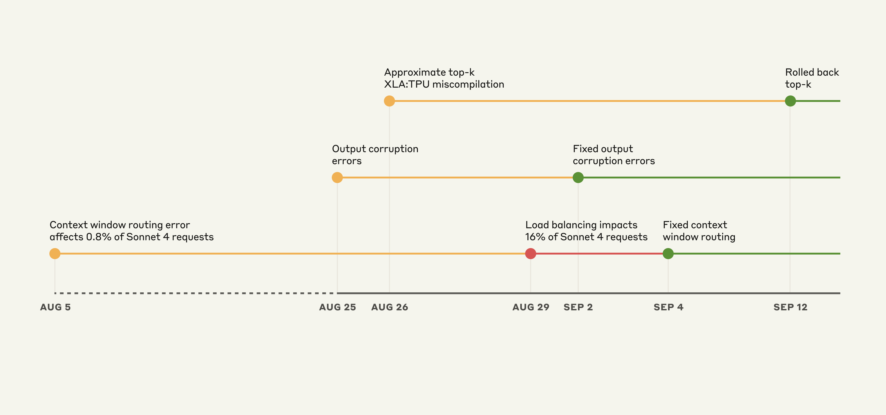
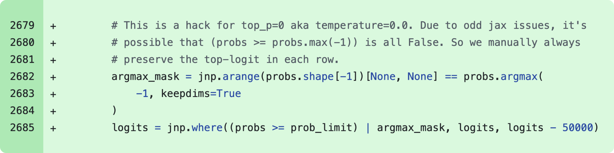
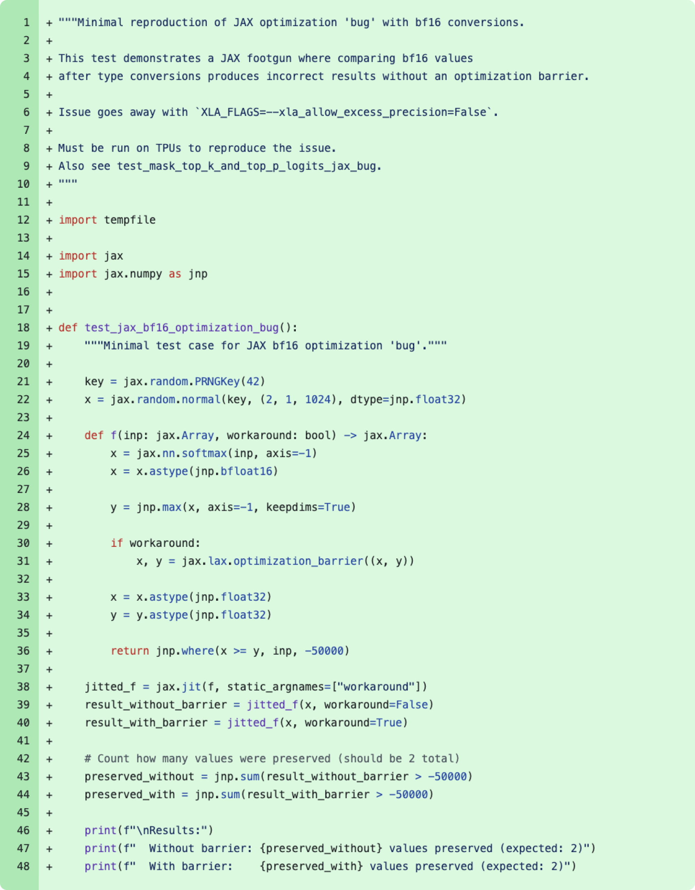
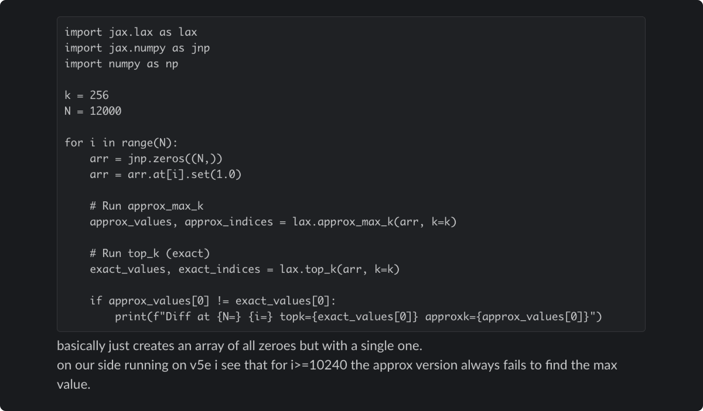

# 三个近期问题的事后分析

> 原文：[A postmortem of three recent issues](https://www.anthropic.com/engineering/a-postmortem-of-three-recent-issues)
> 来源：Anthropic Engineering | 2025-09-17
> 作者：Sam McAllister

---

## 索引

- [概述](#概述)
- [Claude 的大规模服务架构](#claude-的大规模服务架构)
- [事件时间线](#事件时间线)
- [问题一：上下文窗口路由错误](#问题一上下文窗口路由错误)
- [问题二：输出损坏](#问题二输出损坏)
- [问题三：近似 top-k XLA:TPU 编译错误](#问题三近似-top-k-xlatpu-编译错误)
- [深入 XLA 编译器 bug](#深入-xla-编译器-bug)
- [为什么检测困难](#为什么检测困难)
- [改进措施](#改进措施)

---

## 概述

8 月至 9 月初，三个基础设施 bug 间歇性地降低了 Claude 的响应质量。这些问题现已解决。

直白地说：**Anthropic 从未因需求、时间或服务器负载而降低模型质量。** 用户报告的问题完全是基础设施 bug 造成的。

Anthropic 通常不会分享这种程度的基础设施技术细节，但这些问题的范围和复杂性需要更全面的解释。

---

## Claude 的大规模服务架构

Claude 通过第一方 API、Amazon Bedrock 和 Google Cloud Vertex AI 服务数百万用户。部署跨多个硬件平台：AWS Trainium、NVIDIA GPU 和 Google TPU。这提供了全球服务所需的容量和地理分布。

每个硬件平台有不同特性，需要特定优化。尽管如此，Anthropic 对模型实现有**严格的等价标准**——用户无论由哪个平台服务，都应获得相同质量的响应。这种复杂性意味着任何基础设施变更都需要跨所有平台和配置进行仔细验证。

---

## 事件时间线

*Claude API 上的事件示意时间线。黄色：检测到问题，红色：退化加剧，绿色：修复部署。*

三个 bug 的重叠性质使诊断特别困难。第一个 bug 于 8 月 5 日引入，影响约 0.8% 的 Sonnet 4 请求。另外两个 bug 来自 8 月 25 日和 26 日的部署。

虽然初始影响有限，但 8 月 29 日的负载均衡变更开始增加受影响流量。这导致更多用户遇到问题，而其他人继续看到正常性能，产生了令人困惑且矛盾的报告。

---

## 问题一：上下文窗口路由错误

8 月 5 日，部分 Sonnet 4 请求被错误路由到为即将推出的 **1M token 上下文窗口**配置的服务器。最初影响 0.8% 的请求。8 月 29 日，一次常规负载均衡变更无意中增加了路由到 1M 上下文服务器的短上下文请求数量。8 月 31 日最严重的一小时，**16% 的 Sonnet 4 请求**受到影响。

在此期间发出请求的 Claude Code 用户中，约 30% 至少有一条消息被路由到错误的服务器类型。由于路由是"粘性"的——一旦请求被错误服务器服务，后续跟进很可能继续被同一错误服务器服务——部分用户受影响更严重。

Amazon Bedrock 上，误路由流量在 8 月 12 日起峰值为所有 Sonnet 4 请求的 0.18%。Google Cloud Vertex AI 上影响不到 0.0004%。

**修复**：修正路由逻辑确保短上下文和长上下文请求被导向正确的服务器池。9 月 4 日部署修复，9 月 16 日完成第一方平台和 Vertex AI 的推出，9 月 18 日完成 AWS Bedrock。

---

## 问题二：输出损坏

8 月 25 日，向 Claude API TPU 服务器部署了一个错误配置，导致 token 生成时出错。一个运行时性能优化引起的问题偶尔会给不应在给定上下文中产生的 token 分配高概率——例如在英文提示的响应中产生泰文或中文字符，或在代码中产生明显的语法错误。

此损坏影响了 8 月 25-28 日对 Opus 4.1 和 Opus 4 的请求，以及 8 月 25 日至 9 月 2 日对 Sonnet 4 的请求。第三方平台未受影响。

**修复**：9 月 2 日识别问题并回滚变更。在部署流程中添加了意外字符输出的检测测试。

---

## 问题三：近似 top-k XLA:TPU 编译错误

8 月 25 日，部署了改进 Claude token 选择方式的代码。此变更无意中触发了 XLA:TPU 编译器中的一个潜在 bug，已确认影响 Claude Haiku 3.5 的请求。也可能影响了 Claude API 上 Sonnet 4 和 Opus 3 的子集。第三方平台未受影响。

**修复**：9 月 4 日首先观察到影响 Haiku 3.5 并回滚。9 月 12 日注意到与此 bug 兼容的 Opus 3 问题报告并回滚。在 Sonnet 4 上无法复现但出于谨慎也回滚了。同时与 XLA:TPU 团队合作修复编译器 bug，并推出使用**精确 top-k 加增强精度**的修复。

---

## 深入 XLA 编译器 bug

Claude 生成文本时，为每个可能的下一个词计算概率，然后从概率分布中随机采样。使用 **top-p 采样**避免无意义输出——只考虑累积概率达到阈值（通常 0.99 或 0.999）的词。在 TPU 上，模型跨多个芯片运行，概率计算发生在不同位置。排序这些概率需要芯片间协调数据，这很复杂。

2024 年 12 月，发现 TPU 实现在 temperature 为零时偶尔会丢弃最高概率 token。部署了一个 workaround 修复此情况。

*2024 年 12 月修补 temperature=0 时意外丢弃 token bug 的代码片段。*

根本原因涉及**混合精度算术**。模型以 bf16（16 位浮点）计算下一 token 概率。但向量处理器是 fp32 原生的，所以 TPU 编译器（XLA）可以通过将某些操作转换为 fp32（32 位）来优化运行时。此优化由 `xla_allow_excess_precision` 标志控制，默认为 true。

这导致了不匹配：应该在最高概率 token 上达成一致的操作以不同精度级别运行。精度不匹配意味着它们不同意哪个 token 概率最高，导致最高概率 token 有时完全从考虑中消失。

8 月 26 日，部署了采样代码重写来修复精度问题并改进达到 top-p 阈值的概率处理。但在修复这些问题时，暴露了一个更棘手的问题。

*代码片段：作为 8 月 11 日变更一部分合并的最小化复现器，追溯了 2024 年 12 月 workaround 的"bug"根因。实际上这是 `xla_allow_excess_precision` 标志的预期行为。*

修复移除了 12 月的 workaround，因为认为已解决了根本原因。这导致了 **approximate top-k** 操作中更深层的 bug——一个快速找到最高概率 token 的性能优化。这个近似有时返回完全错误的结果，但只在特定 batch size 和模型配置下。12 月的 workaround 一直在无意中掩盖这个问题。

*与开发该算法的 XLA:TPU 工程师分享的底层 approximate top-k bug 复现器。代码在 CPU 上运行时返回正确结果。*

Bug 的行为令人沮丧地不一致。它随不相关因素变化——之前或之后运行了什么操作、是否启用了调试工具。同一个 prompt 可能在一个请求上完美工作，在下一个上失败。

调查中还发现精确 top-k 操作不再有曾经的性能惩罚。从近似切换到**精确 top-k**，并将一些额外操作标准化为 fp32 精度。模型质量不可妥协，接受了轻微的效率影响。

---

## 为什么检测困难

验证流程通常依赖 benchmark、安全评估和性能指标。工程团队进行抽查并先部署到小型"金丝雀"组。

这些问题暴露了应该更早识别的关键缺口：

- 运行的评估根本**没有捕获用户报告的退化**，部分原因是 Claude 通常能从孤立错误中很好地恢复。
- 内部隐私和安全控制限制了工程师访问用户与 Claude 交互的方式和时间——保护了用户隐私但阻止了检查识别或复现 bug 所需的问题交互。
- 每个 bug 在不同平台以不同速率产生不同症状，创造了不指向任何单一原因的混乱报告组合。看起来像随机、不一致的退化。
- 更根本地，**过度依赖噪声评估**。虽然意识到在线报告增加，但缺乏将这些与每个近期变更联系起来的清晰方式。8 月 29 日负面报告激增时，没有立即将其与一个看似标准的负载均衡变更联系起来。

---

## 改进措施

1. **更敏感的评估**：开发了能更可靠地区分工作和损坏实现的评估。将持续改进以更密切地监控模型质量。
2. **更多地方的质量评估**：将在真正的生产系统上持续运行评估，以捕获上下文窗口负载均衡错误等问题。
3. **更快的调试工具**：开发基础设施和工具来更好地调试社区反馈，同时不牺牲用户隐私。

评估和监控很重要。但这些事件表明，当 Claude 的响应不符合通常标准时，还需要来自用户的持续信号。用户可以使用 Claude Code 中的 `/bug` 命令或 Claude 应用中的"踩"按钮发送反馈。
