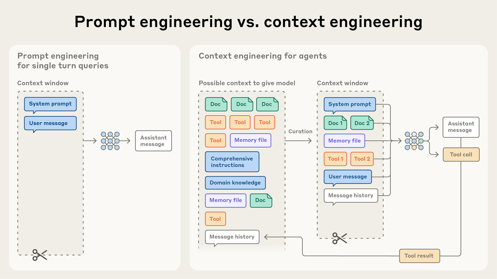

# AI Agent的有效上下文工程

> 原文：[Effective context engineering for AI agents](https://www.anthropic.com/engineering/effective-context-engineering-for-ai-agents)
> 来源：Anthropic Engineering | 2025-09-29
> 作者：Prithvi Rajasekaran, Ethan Dixon, Carly Ryan, Jeremy Hadfield

---

## 索引

- [Context Engineering vs. Prompt Engineering](#context-engineering-vs-prompt-engineering)
- [为什么上下文工程对构建capable agent至关重要](#为什么上下文工程对构建capable-agent至关重要)
- [有效上下文的解剖](#有效上下文的解剖)
- [上下文检索与Agentic搜索](#上下文检索与agentic搜索)
- [长周期任务的上下文工程](#长周期任务的上下文工程)
  - [Compaction（压缩）](#compaction压缩)
  - [结构化笔记](#结构化笔记)
  - [Sub-agent架构](#sub-agent架构)
- [结论](#结论)

---

构建LLM应用正在从"找到正确的prompt措辞"转变为回答一个更广泛的问题：**"什么样的上下文配置最可能产生模型的期望行为？"**

**上下文（Context）** 指的是从LLM采样时包含的token集合。**工程（Engineering）** 问题是：在LLM固有约束下优化这些token的效用，以一致地达成期望结果。有效驾驭LLM往往需要**以上下文为单位思考**——考虑LLM在任何给定时刻可用的整体状态，以及该状态可能产生的行为。

---

## Context Engineering vs. Prompt Engineering

在Anthropic，我们将context engineering视为prompt engineering的自然演进。

**Prompt engineering** 指的是为最优结果编写和组织LLM指令的方法。**Context engineering** 指的是在LLM推理期间策划和维护最优token集合（信息）的策略集，包括prompt之外可能进入上下文的所有其他信息。

在LLM工程的早期，prompting是AI工程工作的最大组成部分——大多数用例需要为one-shot分类或文本生成任务优化prompt。但随着我们转向构建更capable的agent——跨多轮推理和更长时间范围运行——我们需要管理**整个上下文状态**的策略：系统指令、工具、MCP、外部数据、消息历史等。

Agent在循环中运行，生成越来越多**可能**与下一轮推理相关的数据，这些信息必须被循环精炼。Context engineering是从不断演化的可能信息宇宙中，策划**放入有限context window的内容**的艺术与科学。

与编写prompt这个离散任务不同，context engineering是迭代的——策划阶段在每次决定传什么给模型时都会发生。

---

## 为什么上下文工程对构建capable agent至关重要

尽管LLM速度快且能管理越来越大的数据量，我们观察到LLM和人类一样，**在某个点会失去焦点或产生困惑**。Needle-in-a-haystack风格的基准测试揭示了**context rot（上下文腐烂）** 的概念：随着context window中token数量增加，模型从该上下文中准确回忆信息的能力下降。

虽然不同模型的退化程度不同，但这个特征在所有模型中都会出现。因此，上下文必须被视为**边际收益递减的有限资源**。就像人类有有限的工作记忆容量，LLM有一个"注意力预算"（attention budget），在解析大量上下文时会被消耗。每引入一个新token都会消耗这个预算，增加了精心策划可用token的必要性。

这种注意力稀缺源于LLM的架构约束。LLM基于transformer架构，使每个token能**关注上下文中的每一个其他token**。这导致n个token产生n²个成对关系。随着上下文长度增加，模型捕获这些成对关系的能力被摊薄，在上下文大小和注意力聚焦之间产生天然张力。

这些现实意味着：**深思熟虑的context engineering对构建capable agent至关重要。**

---

## 有效上下文的解剖

鉴于LLM受有限注意力预算约束，好的context engineering意味着找到**最小的高信号token集合**，最大化期望结果的可能性。

### System Prompts

应该极其清晰，使用简单直接的语言，在**正确的高度**呈现想法。正确的高度是两种常见失败模式之间的Goldilocks区间：

- **一个极端**：工程师在prompt中硬编码复杂、脆弱的逻辑来引出精确的agent行为。这创造了脆弱性，随时间增加维护复杂度。
- **另一个极端**：工程师提供模糊、高层的指导，未能给LLM具体信号，或错误地假设共享上下文。

最优高度取得平衡：**足够具体以有效引导行为，又足够灵活以提供强启发式规则。**

我们建议将prompt组织为不同的section（如 `<background_information>`、`<instructions>`、`## Tool guidance`、`## Output description` 等），使用XML标签或Markdown标题来划分。

无论如何组织system prompt，你应该追求**完整描述期望行为的最小信息集**。注意"最小"不一定意味着"短"——你仍需给agent足够的前置信息确保它遵循期望行为。最好从用最强模型测试最小prompt开始，然后根据初始测试中发现的失败模式添加清晰的指令和示例。

### Tools

工具允许agent与环境交互并在工作时拉入新的额外上下文。因为工具定义了agent与其信息/行动空间之间的契约，工具必须促进效率——既返回token高效的信息，又鼓励高效的agent行为。

类似设计良好的代码库中的函数，工具应该是自包含的、对错误健壮的、对其预期用途极其清晰的。

**最常见的失败模式**是臃肿的工具集——覆盖太多功能或导致"该用哪个工具"的模糊决策点。如果人类工程师都无法明确说出在给定情况下应该用哪个工具，AI agent也不能被期望做得更好。

### Examples（Few-shot）

提供示例是我们继续强烈建议的最佳实践。但团队经常把一堆边界情况塞进prompt，试图表达LLM应遵循的每条规则。**我们不推荐这样做。** 相反，我们建议策划一组多样的、典型的示例，有效展示agent的期望行为。对LLM来说，示例是"一图胜千言"。

---

## 上下文检索与Agentic搜索

在《Building effective AI agents》中，我们强调了工作流和agent的区别。此后，我们倾向于一个简单定义：**Agent就是LLM在循环中自主使用工具。**

随着底层模型变得更capable，agent的自主程度可以扩展：更聪明的模型允许agent独立导航复杂问题空间并从错误中恢复。

我们现在看到工程师思考agent上下文设计方式的转变。今天，许多AI原生应用使用某种形式的embedding-based预推理检索来呈现重要上下文。随着领域转向更agentic的方法，我们越来越多地看到团队用**"just in time"上下文策略**增强这些检索系统。

### Just-in-time上下文

Agent不是预处理所有相关数据，而是维护**轻量级标识符**（文件路径、存储的查询、网页链接等），在运行时使用工具动态加载数据到上下文中。

Anthropic的Claude Code使用这种方法对大型数据库执行复杂数据分析。模型可以写定向查询、存储结果、利用 `head` 和 `tail` 等Bash命令分析大量数据，而无需将完整数据对象加载到上下文中。

这种方法镜像人类认知：我们通常不记忆整个信息语料库，而是引入外部组织和索引系统（文件系统、收件箱、书签）来按需检索相关信息。

### 渐进式披露

让agent自主导航和检索数据还实现了**渐进式披露（progressive disclosure）**——允许agent通过探索逐步发现相关上下文。每次交互产生的上下文为下一个决策提供信息：文件大小暗示复杂度；命名约定暗示用途；时间戳可以代理相关性。

Agent可以逐层组装理解，只在工作记忆中保留必要的内容，利用笔记策略实现额外持久化。

### 混合策略

当然有权衡：运行时探索比检索预计算数据慢。最有效的agent可能采用**混合策略**——预先检索一些数据以提速，同时允许进一步的自主探索。

Claude Code就是采用混合模型的agent：`CLAUDE.md` 文件被直接放入上下文，而 `glob` 和 `grep` 等原语允许它导航环境并just-in-time检索文件，有效绕过了陈旧索引和复杂语法树的问题。

鉴于领域的快速进展，**"做最简单的有效方案"** 可能仍是我们对构建agent团队的最佳建议。

---

## 长周期任务的上下文工程

长周期任务要求agent在token数超过context window的动作序列中保持连贯性、上下文和目标导向行为。对于跨越数十分钟到数小时的持续工作（如大型代码库迁移或综合研究项目），agent需要专门技术来绕过context window大小限制。

等待更大的context window看似显而易见的策略。但在可预见的未来，所有大小的context window都可能受到context pollution和信息相关性问题的影响。为使agent在扩展时间范围内有效工作，我们开发了几种直接解决这些约束的技术。

---

### Compaction（压缩）

Compaction是在对话接近context window限制时，总结其内容并用摘要重新初始化新context window的做法。它通常是context engineering中驱动更好长期连贯性的**第一个杠杆**。

在Claude Code中，我们将消息历史传给模型进行总结和压缩最关键的细节。模型保留架构决策、未解决的bug和实现细节，同时丢弃冗余的工具输出或消息。Agent然后可以用这个压缩上下文加上最近访问的5个文件继续工作。

Compaction的艺术在于**选择保留什么vs丢弃什么**——过于激进的压缩可能导致丢失微妙但关键的上下文，其重要性可能后来才显现。

我们建议：
- 从最大化recall开始，确保压缩prompt捕获trace中每条相关信息
- 然后迭代提升precision，消除多余内容
- 最安全的轻量压缩形式之一是**清除工具调用结果**——一旦工具在消息历史深处被调用过，agent为什么还需要看到原始结果？

---

### 结构化笔记

结构化笔记（agentic memory）是agent定期将笔记写入context window之外的持久化存储的技术。这些笔记在后续被拉回context window。

这个策略以最小开销提供持久记忆。就像Claude Code创建待办列表，或你的自定义agent维护一个 `NOTES.md` 文件——这个简单模式允许agent跟踪复杂任务的进展，维护否则会在数十次工具调用中丢失的关键上下文和依赖。

**Claude玩Pokémon** 展示了记忆如何在非编码领域转变agent能力。Agent在数千个游戏步骤中维护精确计数——跟踪目标如"过去1,234步我一直在Route 1训练Pokémon，Pikachu已经升了8级，目标是10级。"它在没有任何关于记忆结构的提示下，自发开发了已探索区域的地图、记住解锁了哪些关键成就、维护帮助它学习哪些攻击对不同对手最有效的战斗策略笔记。

上下文重置后，agent读取自己的笔记并继续多小时的训练序列或地牢探索。

---

### Sub-agent架构

Sub-agent架构提供了另一种绕过上下文限制的方式。不是一个agent试图维护整个项目的状态，而是**专门化的sub-agent用干净的context window处理聚焦的任务**。主agent用高层计划协调，sub-agent执行深度技术工作或使用工具查找相关信息。

每个sub-agent可能进行大量探索（使用数万token或更多），但只返回**浓缩的工作摘要**（通常1,000-2,000 token）。

这实现了清晰的关注点分离——详细的搜索上下文保持在sub-agent内部隔离，而主agent专注于综合和分析结果。

### 选择哪种方法

取决于任务特征：
- **Compaction**：维护对话流，适合需要大量来回的任务
- **笔记**：适合有明确里程碑的迭代开发
- **Multi-agent架构**：处理复杂研究和分析，并行探索有回报

即使模型持续改进，在扩展交互中维护连贯性的挑战仍将是构建更有效agent的核心。

---

## 结论

Context engineering代表了我们构建LLM应用方式的根本转变。随着模型变得更capable，挑战不仅是打造完美的prompt——而是**深思熟虑地策划每一步进入模型有限注意力预算的信息**。

无论你是为长周期任务实现compaction、设计token高效的工具、还是让agent just-in-time探索环境，指导原则始终相同：**找到最小的高信号token集合，最大化期望结果的可能性。**

随着模型改进，这些技术将继续演化。我们已经看到更聪明的模型需要更少的规范性工程，允许agent以更大自主性运行。但即使能力扩展，**将上下文视为珍贵的有限资源**仍将是构建可靠、有效agent的核心。
