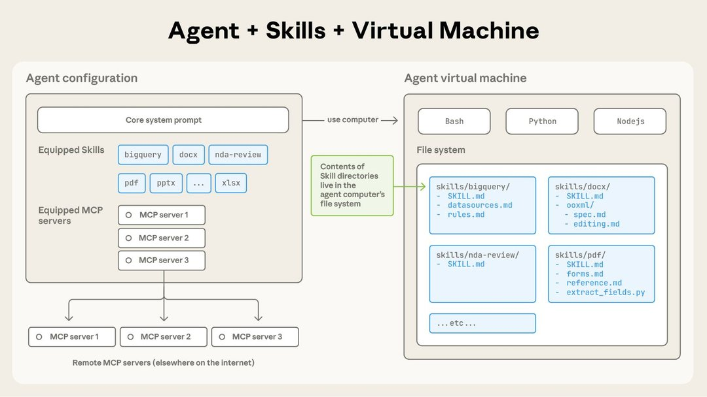
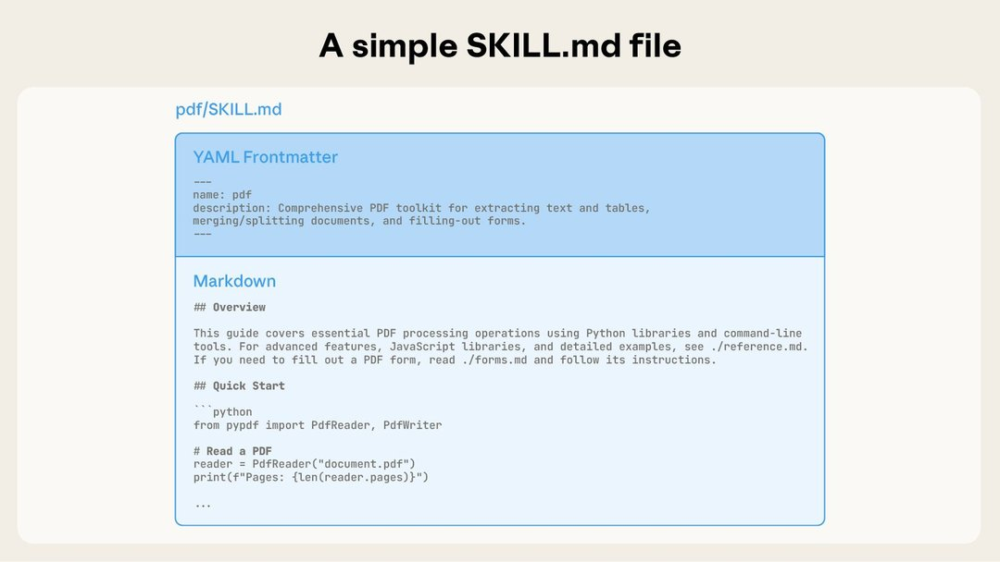
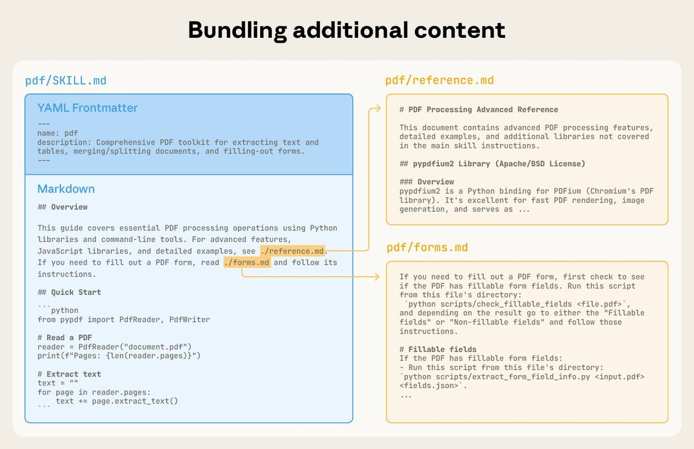
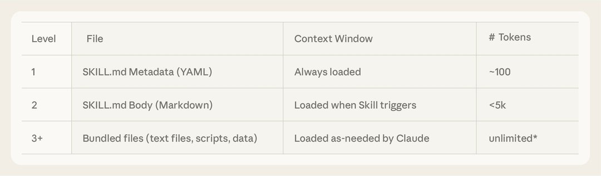
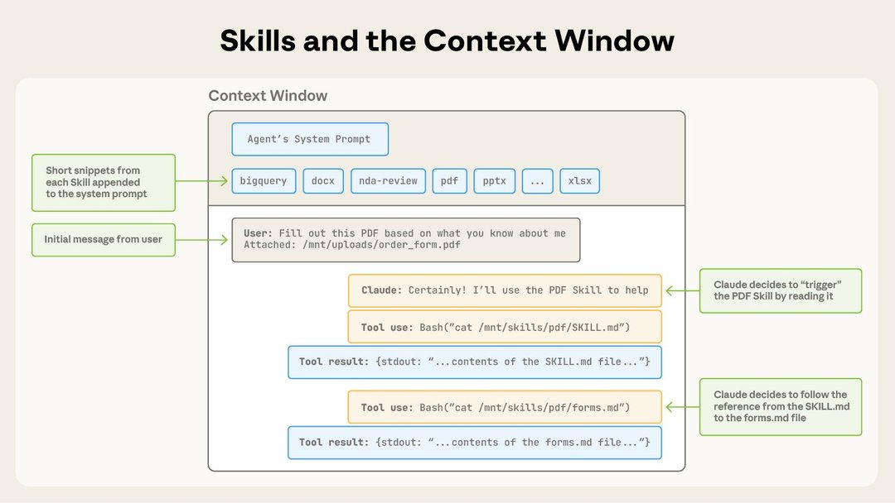

# 用 Agent Skills 装备 Agent 应对真实世界

> 原文：[Equipping agents for the real world with Agent Skills](https://www.anthropic.com/engineering/equipping-agents-for-the-real-world-with-agent-skills)
> 来源：Anthropic Engineering | 2025-10-16
> 作者：Barry Zhang, Keith Lazuka, Mahesh Murag

---

## 索引

- [什么是 Agent Skills](#什么是-agent-skills)
- [Skill 的解剖结构](#skill-的解剖结构)
- [渐进式披露](#渐进式披露)
- [Skills 与 Context Window](#skills-与-context-window)
- [Skills 与代码执行](#skills-与代码执行)
- [开发和评估 Skills](#开发和评估-skills)
- [安全考量](#安全考量)
- [Skills 的未来](#skills-的未来)

---

## 什么是 Agent Skills

Claude 很强大，但真实工作需要**程序性知识和组织上下文**。Agent Skills 是一种新方式——用文件和文件夹构建专门化的 agent。

> 更新：我们已将 Agent Skills 作为开放标准发布，支持跨平台可移植性。（2025年12月18日）

随着模型能力提升，我们现在可以构建与完整计算环境交互的通用 agent。Claude Code 就能使用本地代码执行和文件系统跨领域完成复杂任务。但随着这些 agent 变得更强大，我们需要更**可组合、可扩展、可移植**的方式来装备它们的领域专业知识。

这促使我们创建了 **Agent Skills**：组织好的指令、脚本和资源文件夹，agent 可以动态发现和加载以更好地执行特定任务。

为 agent 构建 skill 就像为新员工准备入职指南。不再为每个用例构建碎片化的定制 agent，任何人都可以通过捕获和分享程序性知识来用可组合的能力专门化他们的 agent。

*图：Skill 是包含 SKILL.md 文件的目录*

---

## Skill 的解剖结构

最简单的形式下，skill 是一个包含 **SKILL.md 文件**的目录。这个文件必须以 YAML frontmatter 开头，包含必需的元数据：`name` 和 `description`。

启动时，agent 将每个已安装 skill 的 `name` 和 `description` 预加载到 system prompt 中。

*图：SKILL.md 文件必须以 YAML Frontmatter 开头*

---

## 渐进式披露

这个元数据是**渐进式披露（progressive disclosure）的第一层**：提供刚好足够的信息让 Claude 知道何时使用每个 skill，而不将全部内容加载到上下文中。

- **第一层**：`name` + `description`（始终在 system prompt 中）
- **第二层**：SKILL.md 正文（Claude 认为 skill 相关时加载）
- **第三层及以后**：skill 目录中的附加文件（Claude 按需导航和发现）

*图：通过附加文件纳入更多上下文*

以 PDF skill 为例，`SKILL.md` 引用了两个附加文件（`reference.md` 和 `forms.md`）。通过将表单填写指令移到单独文件，skill 作者保持核心精简，信任 Claude 只在填写表单时才读取 `forms.md`。

渐进式披露是使 Agent Skills 灵活和可扩展的**核心设计原则**。就像一本组织良好的手册——从目录开始，然后是具体章节，最后是详细附录——skill 让 Claude 只在需要时加载信息。

拥有文件系统和代码执行工具的 agent 不需要在处理特定任务时将整个 skill 读入 context window。这意味着 **skill 中可以打包的上下文量实际上是无限的**。

---

## Skills 与 Context Window

*图：Skills 在 context window 中的触发方式*

操作序列：
1. 初始时，context window 有核心 system prompt、每个已安装 skill 的元数据、以及用户的初始消息
2. Claude 通过调用 Bash 工具读取 `pdf/SKILL.md` 的内容来触发 PDF skill
3. Claude 选择读取 skill 附带的 `forms.md` 文件
4. Claude 在加载了 PDF skill 的相关指令后继续执行用户任务

---

## Skills 与代码执行

Skills 还可以包含 Claude 可以自行决定执行的代码作为工具。

LLM 擅长很多任务，但某些操作更适合传统代码执行。例如，通过 token 生成排序列表远比直接运行排序算法昂贵。除了效率考虑，很多应用需要只有代码才能提供的**确定性可靠性**。

*图：Skills 可以包含 Claude 按任务性质自行决定执行的代码*

在 PDF skill 示例中，包含一个预写的 Python 脚本来读取 PDF 并提取所有表单字段。Claude 可以运行这个脚本而无需将脚本或 PDF 加载到上下文中。因为代码是确定性的，这个工作流是一致且可重复的。

---

## 开发和评估 Skills

**从评估开始。** 通过在代表性任务上运行 agent 并观察它们在哪里挣扎或需要额外上下文，识别 agent 能力的具体差距。然后增量构建 skill 来解决这些不足。

**为规模而结构化。** 当 `SKILL.md` 变得笨重时，将内容拆分为单独文件并引用它们。如果某些上下文互斥或很少一起使用，保持路径分离将减少 token 使用。代码既可以作为可执行工具也可以作为文档。

**从 Claude 的视角思考。** 监控 Claude 在真实场景中如何使用你的 skill 并基于观察迭代。特别注意 skill 的 `name` 和 `description`——Claude 用这些来决定是否在响应当前任务时触发 skill。

**与 Claude 一起迭代。** 在与 Claude 工作时，让 Claude 将成功方法和常见错误捕获为 skill 中的可复用上下文和代码。如果它在使用 skill 完成任务时偏离轨道，让它自我反思哪里出了问题。这个过程帮助你发现 Claude 实际需要什么上下文，而非试图提前预测。

---

## 安全考量

Skills 通过指令和代码为 Claude 提供新能力。这意味着恶意 skill 可能在使用环境中引入漏洞，或指导 Claude 泄露数据和执行非预期操作。

建议：
- 只从受信来源安装 skill
- 安装来自不太受信来源的 skill 时，使用前彻底审计
- 特别注意代码依赖和指示 Claude 连接到潜在不受信外部网络源的指令

---

## Skills 的未来

Agent Skills 目前在 Claude.ai、Claude Code、Claude Agent SDK 和 Claude Developer Platform 上受支持。

我们特别兴奋的方向：
- Skills 帮助组织和个人与 Claude 分享上下文和工作流
- Skills 如何补充 MCP 服务器——教 agent 涉及外部工具和软件的更复杂工作流
- 让 agent 自己创建、编辑和评估 Skills——将自己的行为模式编码为可复用能力

Skills 是一个简单概念，有着相应简单的格式。这种简单性使组织、开发者和终端用户更容易构建定制 agent 并赋予它们新能力。
