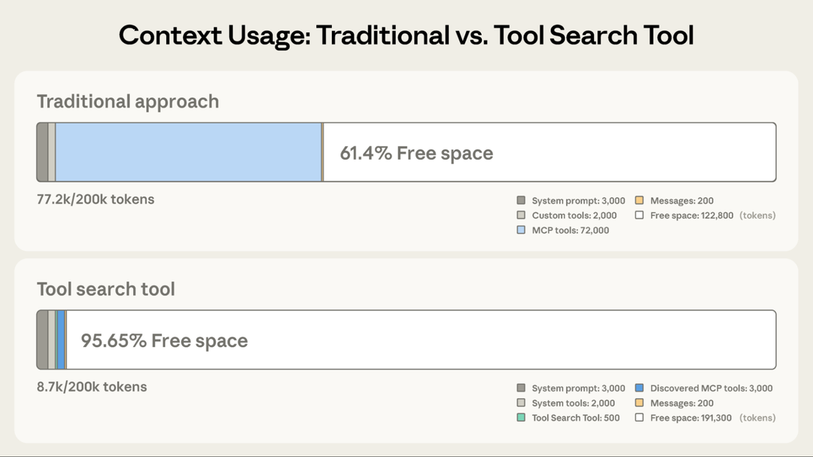
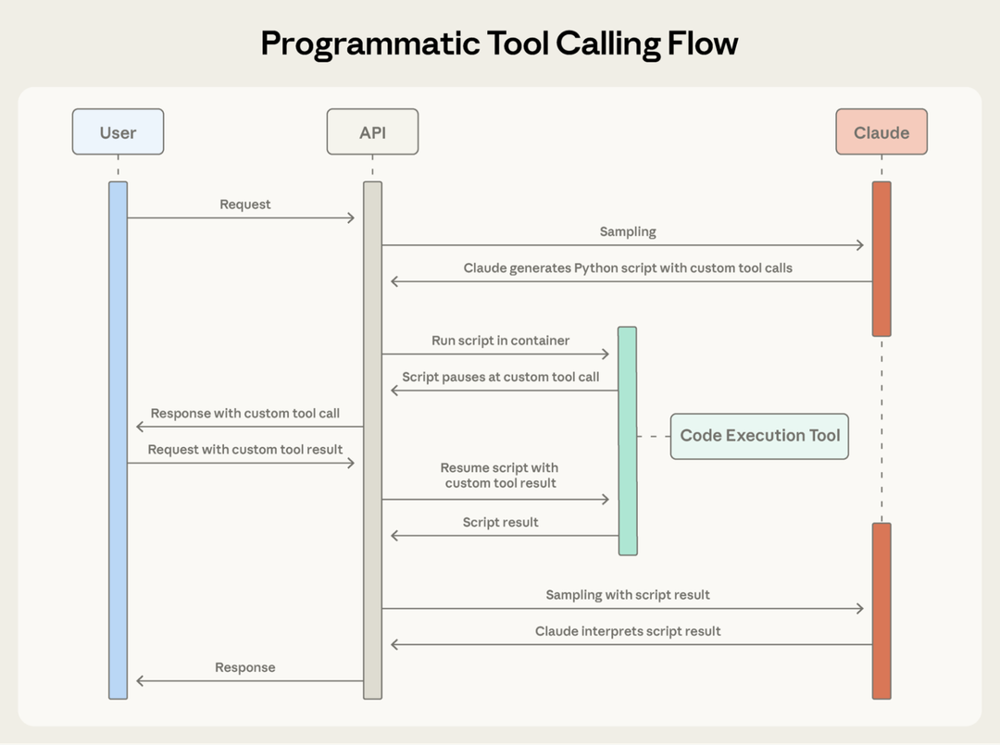

<style>
body, .markdown-body {
  font-family: "Noto Serif SC", "Source Han Serif CN", "STSong", Georgia, serif;
  font-size: 15px;
  line-height: 2;
  max-width: 38em;
  margin: 0 auto;
  padding: 2em;
  color: #2c2c2c;
  background: #faf8f5;
}
</style>

> 原文：[Introducing advanced tool use on the Claude Developer Platform](https://www.anthropic.com/engineering/advanced-tool-use)
> 来源：Anthropic Engineering | 2025-11-24
> 作者：Bin Wu 等

## 索引

- [Tool Search Tool](#tool-search-tool)
- [Programmatic Tool Calling](#programmatic-tool-calling)
- [Tool Use Examples](#tool-use-examples)
- [最佳实践](#最佳实践)
- [开始使用](#开始使用)

---

AI agent 的未来是模型能无缝使用成百上千个工具。一个 IDE 助手集成 git 操作、文件管理、包管理器、测试框架和部署流水线；一个运维协调器连接 Slack、GitHub、Google Drive、Jira、公司数据库和几十个 MCP server。

要构建有效的 agent，它们需要能使用无限的工具库，而不是把所有工具定义一股脑塞进上下文。之前关于用 MCP 实现代码执行的文章讨论过，工具结果和定义有时会在 agent 读取请求之前就消耗 50,000+ token。Agent 应该**按需发现和加载工具**，只保留与当前任务相关的内容。

Agent 还需要能**从代码中调用工具**。用自然语言做 tool calling 时，每次调用都需要一次完整的推理，中间结果不管有没有用都会堆积在上下文里。代码天然适合编排逻辑——循环、条件、数据转换。Agent 需要根据任务灵活选择代码执行还是推理。

Agent 还需要**从示例中学习正确的工具用法**，而不仅仅依赖 schema 定义。JSON schema 定义了结构上什么是合法的，但无法表达使用模式：什么时候该包含可选参数、哪些组合有意义、你的 API 期望什么约定。

今天发布三个功能：

- **Tool Search Tool**：让 Claude 用搜索工具访问数千个工具，而不消耗上下文窗口
- **Programmatic Tool Calling**：让 Claude 在代码执行环境中调用工具，减少对上下文窗口的影响
- **Tool Use Examples**：提供一种通用标准来演示如何有效使用给定工具

在内部测试中，这些功能帮助我们构建了传统 tool use 模式无法实现的东西。例如 **Claude for Excel** 使用 Programmatic Tool Calling 来读写数千行的电子表格，而不会让模型的上下文窗口过载。

---

## Tool Search Tool

### 问题

MCP 工具定义提供了重要上下文，但随着更多 server 连接，token 会迅速累积。考虑一个五 server 的配置：

- GitHub：35 个工具（~26K token）
- Slack：11 个工具（~21K token）
- Sentry：5 个工具（~3K token）
- Grafana：5 个工具（~3K token）
- Splunk：2 个工具（~2K token）

这是 58 个工具，在对话开始前就消耗了约 55K token。再加上 Jira（单独就用 ~17K token），很快就逼近 100K+ token 的开销。在 Anthropic 内部，我们见过优化前工具定义消耗 134K token 的情况。

但 token 成本不是唯一问题。最常见的失败是**选错工具和参数错误**，尤其是工具名称相似时，比如 `notification-send-user` vs. `notification-send-channel`。

### 解决方案

Tool Search Tool 不预先加载所有工具定义，而是按需发现工具。Claude 只看到当前任务实际需要的工具。


*Tool Search Tool 保留了 191,300 token 的上下文，而传统方式只保留 122,800 token。*

传统方式：

- 所有工具定义预先加载（50+ MCP 工具 ~72K token）
- 对话历史和 system prompt 争夺剩余空间
- 总上下文消耗：工作开始前 ~77K token

使用 Tool Search Tool：

- 只预先加载 Tool Search Tool 本身（~500 token）
- 按需发现工具（3-5 个相关工具，~3K token）
- 总上下文消耗：~8.7K token，**保留 95% 的上下文窗口**

这代表 **85% 的 token 使用量减少**，同时保持对完整工具库的访问。内部测试显示，在大型工具库上 MCP 评估的准确率显著提升：Opus 4 从 49% 提升到 74%，Opus 4.5 从 79.5% 提升到 88.1%。

### 工作原理

Tool Search Tool 让 Claude 动态发现工具，而不是预先加载所有定义。你把所有工具定义提供给 API，但用 `defer_loading: true` 标记工具，使其可按需发现。延迟加载的工具不会初始加载到 Claude 的上下文中。Claude 只看到 Tool Search Tool 本身加上任何 `defer_loading: false` 的工具（你最关键、最常用的工具）。

当 Claude 需要特定能力时，它搜索相关工具。Tool Search Tool 返回匹配工具的引用，这些引用会被展开为完整定义加入 Claude 的上下文。

例如，如果 Claude 需要与 GitHub 交互，它搜索 "github"，只有 `github.createPullRequest` 和 `github.listIssues` 被加载——而不是你来自 Slack、Jira 和 Google Drive 的其他 50+ 工具。

这样 Claude 可以访问完整工具库，同时只为实际需要的工具付出 token 成本。

**Prompt caching 说明**：Tool Search Tool 不会破坏 prompt caching，因为延迟加载的工具完全排除在初始 prompt 之外。它们只在 Claude 搜索后才加入上下文，所以你的 system prompt 和核心工具定义仍然可缓存。

**实现方式**：

```json
{
  "tools": [
    // 包含一个 tool search tool（regex、BM25 或自定义）
    {"type": "tool_search_tool_regex_20251119", "name": "tool_search_tool_regex"},

    // 标记工具为按需发现
    {
      "name": "github.createPullRequest",
      "description": "Create a pull request",
      "input_schema": {...},
      "defer_loading": true
    }
    // ... 数百个更多的延迟加载工具
  ]
}
```

对于 MCP server，可以延迟加载整个 server，同时保持特定高频工具加载：

```json
{
  "type": "mcp_toolset",
  "mcp_server_name": "google-drive",
  "default_config": {"defer_loading": true},
  "configs": {
    "search_files": {"defer_loading": false}  // 保持最常用工具加载
  }
}
```

Claude Developer Platform 开箱提供基于 regex 和 BM25 的搜索工具，你也可以用 embedding 或其他策略实现自定义搜索工具。

### 何时使用

Tool Search Tool 在工具调用前增加了一个搜索步骤，所以当上下文节省和准确率提升超过额外延迟时，ROI 最高。

**适合使用**：

- 工具定义消耗 >10K token
- 遇到工具选择准确率问题
- 构建多 server 的 MCP 系统
- 10+ 工具可用

**收益较小**：

- 小工具库（<10 个工具）
- 所有工具在每次会话中都频繁使用
- 工具定义很紧凑

---

## Programmatic Tool Calling

### 问题

传统 tool calling 在工作流变复杂时产生两个根本问题：

- **中间结果的上下文污染**：当 Claude 分析 10MB 日志文件寻找错误模式时，整个文件进入上下文窗口，尽管 Claude 只需要错误频率的摘要。跨多个表获取客户数据时，每条记录都堆积在上下文中，不管是否相关。这些中间结果消耗大量 token 预算，可能把重要信息挤出上下文窗口。

- **推理开销和手动综合**：每次 tool call 需要一次完整的模型推理。收到结果后，Claude 必须"肉眼"检查数据来提取相关信息、推理各部分如何组合、决定下一步做什么——全部通过自然语言处理。一个五步工具工作流意味着五次推理加上 Claude 解析每个结果、比较值、综合结论。这既慢又容易出错。

### 解决方案

Programmatic Tool Calling（PTC）让 Claude 通过代码而非逐个 API 往返来编排工具。Claude 不再逐个请求工具并将每个结果返回到上下文，而是写代码调用多个工具、处理输出、**控制什么信息实际进入上下文窗口**。

Claude 擅长写代码，让它用 Python 表达编排逻辑而非通过自然语言工具调用，你能得到更可靠、精确的控制流。循环、条件、数据转换和错误处理在代码中都是显式的，而非隐含在 Claude 的推理中。

#### 示例：预算合规检查

考虑一个常见业务任务："哪些团队成员超出了 Q3 差旅预算？"

有三个工具可用：

- `get_team_members(department)` — 返回团队成员列表（含 ID 和级别）
- `get_expenses(user_id, quarter)` — 返回用户的费用明细
- `get_budget_by_level(level)` — 返回员工级别的预算限额

**传统方式**：

- 获取团队成员 → 20 人
- 对每个人获取 Q3 费用 → 20 次 tool call，每次返回 50-100 条明细（机票、酒店、餐饮、收据）
- 获取按级别的预算限额
- 所有这些进入 Claude 的上下文：2,000+ 条费用明细（50 KB+）
- Claude 手动汇总每个人的费用，查找预算，比较
- 更多模型往返，大量上下文消耗

**使用 Programmatic Tool Calling**：

Claude 不再让每个工具结果返回自身，而是写一个 Python 脚本编排整个工作流。脚本在 Code Execution 工具（沙箱环境）中运行，需要工具结果时暂停。你通过 API 返回工具结果，它们被脚本处理而非被模型消费。脚本继续执行，Claude 只看到最终输出。


*Programmatic Tool Calling 让 Claude 通过代码而非逐个 API 往返来编排工具，支持并行工具执行。*

Claude 的编排代码示例：

```python
team = await get_team_members("engineering")

# 获取每个唯一级别的预算
levels = list(set(m["level"] for m in team))
budget_results = await asyncio.gather(*[
    get_budget_by_level(level) for level in levels
])

# 创建查找字典
budgets = {level: budget for level, budget in zip(levels, budget_results)}

# 并行获取所有费用
expenses = await asyncio.gather(*[
    get_expenses(m["id"], "Q3") for m in team
])

# 找出超出差旅预算的员工
exceeded = []
for member, exp in zip(team, expenses):
    budget = budgets[member["level"]]
    total = sum(e["amount"] for e in exp)
    if total > budget["travel_limit"]:
        exceeded.append({
            "name": member["name"],
            "spent": total,
            "limit": budget["travel_limit"]
        })

print(json.dumps(exceeded))
```

Claude 的上下文只收到最终结果：超出预算的两三个人。2,000+ 条明细、中间汇总和预算查找都不影响 Claude 的上下文，将消耗从 200KB 原始费用数据降到仅 1KB 结果。

效率提升显著：

- **Token 节省**：将中间结果排除在 Claude 上下文之外，PTC 大幅减少 token 消耗。复杂研究任务的平均使用量从 43,588 降到 27,297 token，**减少 37%**。
- **延迟降低**：每次 API 往返需要模型推理（数百毫秒到数秒）。当 Claude 在单个代码块中编排 20+ 次 tool call 时，你消除了 19+ 次推理。API 处理工具执行而无需每次都返回模型。
- **准确率提升**：通过写显式编排逻辑，Claude 比用自然语言处理多个工具结果时犯更少错误。内部知识检索从 25.6% 提升到 28.5%；GIA benchmark 从 46.5% 提升到 51.2%。

### 工作原理

#### 1. 标记工具为可从代码调用

添加 code_execution 到 tools，设置 `allowed_callers` 来 opt-in 工具的程序化执行：

```json
{
  "tools": [
    {
      "type": "code_execution_20250825",
      "name": "code_execution"
    },
    {
      "name": "get_team_members",
      "description": "Get all members of a department...",
      "input_schema": {...},
      "allowed_callers": ["code_execution_20250825"]
    }
  ]
}
```

API 将这些工具定义转换为 Claude 可调用的 Python 函数。

#### 2. Claude 写编排代码

Claude 不再逐个请求工具，而是生成 Python 代码：

```json
{
  "type": "server_tool_use",
  "id": "srvtoolu_abc",
  "name": "code_execution",
  "input": {
    "code": "team = get_team_members('engineering')\n..."
  }
}
```

#### 3. 工具执行不进入 Claude 的上下文

当代码调用 `get_expenses()` 时，你收到一个带 `caller` 字段的工具请求：

```json
{
  "type": "tool_use",
  "id": "toolu_xyz",
  "name": "get_expenses",
  "input": {"user_id": "emp_123", "quarter": "Q3"},
  "caller": {
    "type": "code_execution_20250825",
    "tool_id": "srvtoolu_abc"
  }
}
```

你提供结果，它在 Code Execution 环境中被处理，而非 Claude 的上下文。这个请求-响应循环对代码中的每次 tool call 重复。

#### 4. 只有最终输出进入上下文

代码运行完毕后，只有代码的结果返回给 Claude：

```json
{
  "type": "code_execution_tool_result",
  "tool_use_id": "srvtoolu_abc",
  "content": {
    "stdout": "[{\"name\": \"Alice\", \"spent\": 12500, \"limit\": 10000}...]"
  }
}
```

这就是 Claude 看到的全部，而不是过程中处理的 2000+ 条费用明细。

### 何时使用

**最有益**：

- 处理大数据集但只需要聚合或摘要
- 运行三步以上有依赖的多步工作流
- 在 Claude 看到之前过滤、排序或转换工具结果
- 中间数据不应影响 Claude 推理的任务
- 跨多个项目运行并行操作（如检查 50 个端点）

**收益较小**：

- 简单的单工具调用
- Claude 应该看到并推理所有中间结果的任务
- 响应很小的快速查找

---

## Tool Use Examples

### 问题

JSON Schema 擅长定义结构——类型、必填字段、允许的枚举——但无法表达使用模式：什么时候包含可选参数、哪些组合有意义、你的 API 期望什么约定。

考虑一个工单 API，schema 定义了 `title`、`priority`、`labels`、`reporter`（含嵌套 `contact`）、`due_date`、`escalation` 等字段。Schema 定义了什么是合法的，但留下了关键问题：

- **格式歧义**：`due_date` 该用 "2024-11-06"、"Nov 6, 2024" 还是 "2024-11-06T00:00:00Z"？
- **ID 约定**：`reporter.id` 是 UUID、"USR-12345" 还是 "12345"？
- **嵌套结构用法**：什么时候该填充 `reporter.contact`？
- **参数关联**：`escalation.level` 和 `escalation.sla_hours` 与 priority 如何关联？

这些歧义会导致格式错误的 tool call 和不一致的参数使用。

### 解决方案

Tool Use Examples 让你直接在工具定义中提供示例 tool call。不再仅依赖 schema，而是向 Claude 展示具体的使用模式：

```json
{
  "name": "create_ticket",
  "input_schema": { /* 同上 */ },
  "input_examples": [
    {
      "title": "Login page returns 500 error",
      "priority": "critical",
      "labels": ["bug", "authentication", "production"],
      "reporter": {
        "id": "USR-12345",
        "name": "Jane Smith",
        "contact": {"email": "jane@acme.com", "phone": "+1-555-0123"}
      },
      "due_date": "2024-11-06",
      "escalation": {"level": 2, "notify_manager": true, "sla_hours": 4}
    },
    {
      "title": "Add dark mode support",
      "labels": ["feature-request", "ui"],
      "reporter": {"id": "USR-67890", "name": "Alex Chen"}
    },
    {
      "title": "Update API documentation"
    }
  ]
}
```

从这三个示例，Claude 学到：

- **格式约定**：日期用 YYYY-MM-DD，用户 ID 遵循 USR-XXXXX，标签用 kebab-case
- **嵌套结构模式**：如何构造 reporter 对象及其嵌套的 contact 对象
- **可选参数关联**：严重 bug 有完整联系信息 + 紧急 SLA 的 escalation；功能请求有 reporter 但没有 contact/escalation；内部任务只有 title

在内部测试中，tool use examples 将复杂参数处理的准确率从 **72% 提升到 90%**。

### 何时使用

**最有益**：

- 合法 JSON 不等于正确用法的复杂嵌套结构
- 有很多可选参数且包含模式很重要的工具
- 有 schema 无法捕获的领域特定约定的 API
- 需要示例来区分使用哪个的相似工具（如 `create_ticket` vs `create_incident`）

**收益较小**：

- 用法明显的简单单参数工具
- Claude 已经理解的标准格式（如 URL 或 email）
- JSON Schema 约束能更好处理的验证问题

---

## 最佳实践

这三个功能协同解决 tool use 工作流中的不同瓶颈。

### 分层策略

不是每个 agent 都需要对每个任务使用全部三个功能。从最大瓶颈开始：

- 工具定义导致的上下文膨胀 → Tool Search Tool
- 大量中间结果污染上下文 → Programmatic Tool Calling
- 参数错误和格式错误的调用 → Tool Use Examples

先解决限制 agent 性能的具体约束，而非一开始就增加复杂性。然后按需叠加。它们是互补的：Tool Search Tool 确保找到正确的工具，Programmatic Tool Calling 确保高效执行，Tool Use Examples 确保正确调用。

### Tool Search Tool 的发现优化

工具搜索匹配名称和描述，所以清晰、描述性的定义能提高发现准确率：

```json
// 好
{
  "name": "search_customer_orders",
  "description": "Search for customer orders by date range, status, or total amount. Returns order details including items, shipping, and payment info."
}

// 差
{
  "name": "query_db_orders",
  "description": "Execute order query"
}
```

在 system prompt 中添加引导，让 Claude 知道有什么可用：

```
You have access to tools for Slack messaging, Google Drive file management,
Jira ticket tracking, and GitHub repository operations. Use the tool search
to find specific capabilities.
```

保持三到五个最常用工具始终加载，其余延迟。这平衡了常见操作的即时访问和其他一切的按需发现。

### Programmatic Tool Calling 的正确执行

由于 Claude 写代码来解析工具输出，清晰地记录返回格式。这帮助 Claude 写出正确的解析逻辑：

```json
{
  "name": "get_orders",
  "description": "Retrieve orders for a customer.\nReturns:\n    List of order objects, each containing:\n    - id (str): Order identifier\n    - total (float): Order total in USD\n    - status (str): One of 'pending', 'shipped', 'delivered'\n    - items (list): Array of {sku, quantity, price}\n    - created_at (str): ISO 8601 timestamp"
}
```

适合 opt-in 程序化编排的工具：

- 可并行运行的工具（独立操作）
- 可安全重试的操作（幂等）

### Tool Use Examples 的参数准确性

编写示例时注意行为清晰度：

- 使用真实数据（真实城市名、合理价格，而非 "string" 或 "value"）
- 展示多样性：最小、部分和完整规格模式
- 保持简洁：每个工具 1-5 个示例
- 聚焦歧义：只在正确用法从 schema 看不明显时添加示例

---

## 开始使用

这些功能以 beta 形式提供。启用方式：添加 beta header 并包含所需工具：

```python
client.beta.messages.create(
    betas=["advanced-tool-use-2025-11-20"],
    model="claude-sonnet-4-5-20250929",
    max_tokens=4096,
    tools=[
        {"type": "tool_search_tool_regex_20251119", "name": "tool_search_tool_regex"},
        {"type": "code_execution_20250825", "name": "code_execution"},
        # 你的工具，带 defer_loading、allowed_callers 和 input_examples
    ]
)
```

详细 API 文档和 SDK 示例见：

- Tool Search Tool 的文档和 cookbook
- Programmatic Tool Calling 的文档和 cookbook
- Tool Use Examples 的文档

这些功能将 tool use 从简单的函数调用推向智能编排。随着 agent 处理跨越数十个工具和大数据集的更复杂工作流，动态发现、高效执行和可靠调用成为基础能力。
