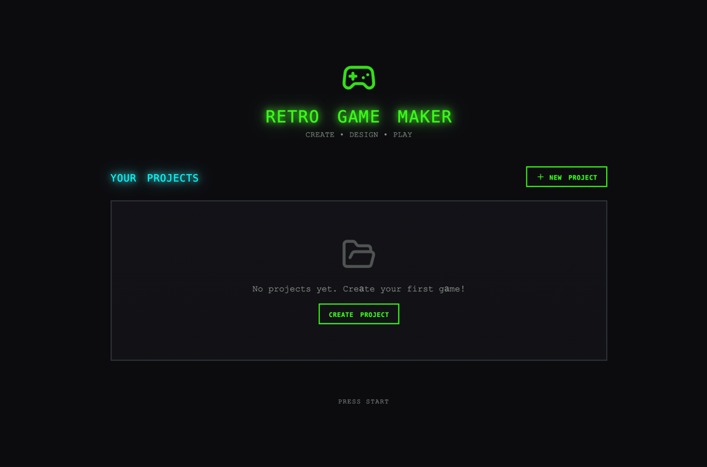
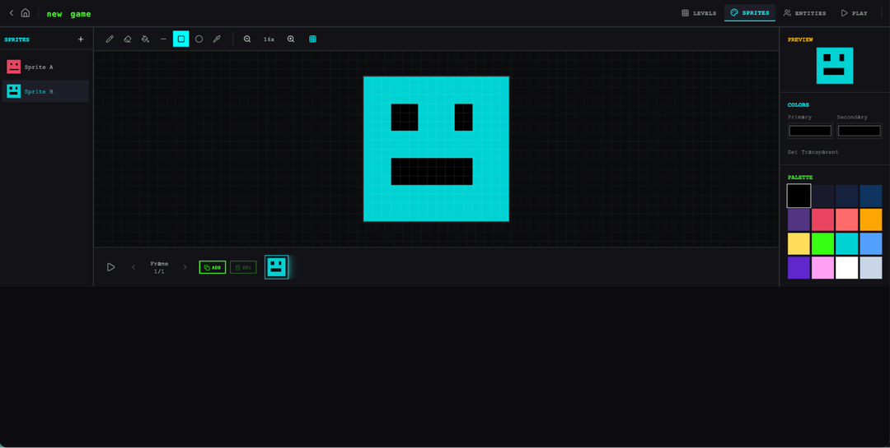
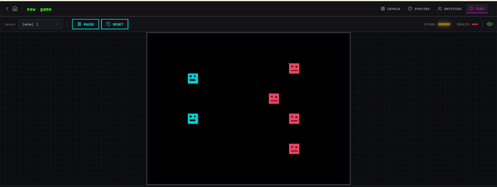
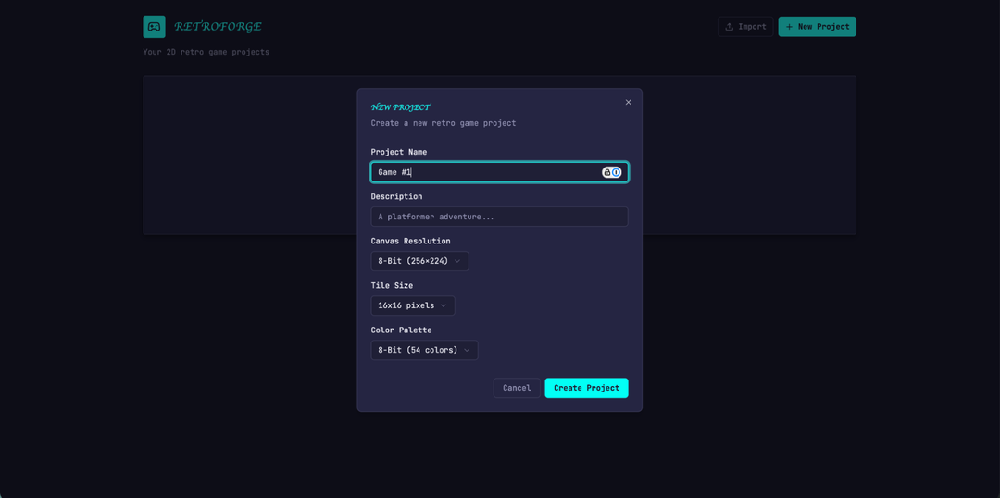
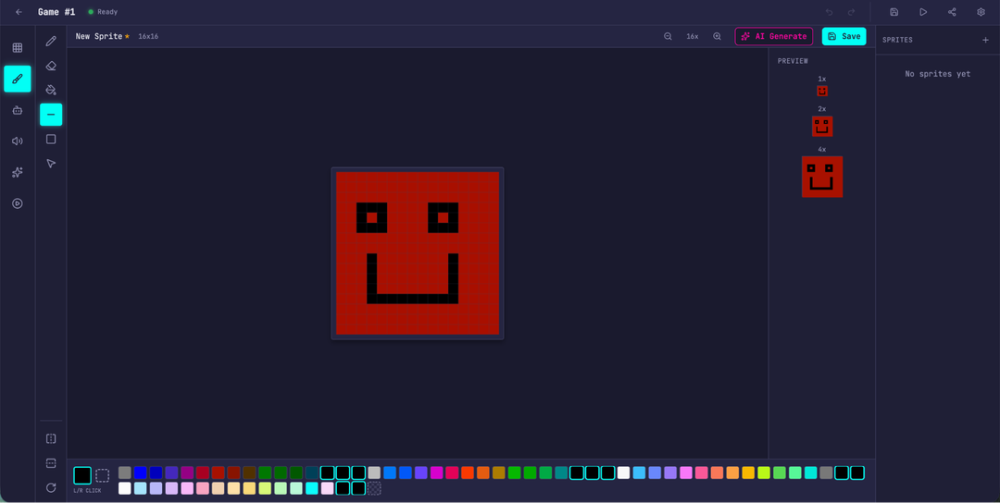
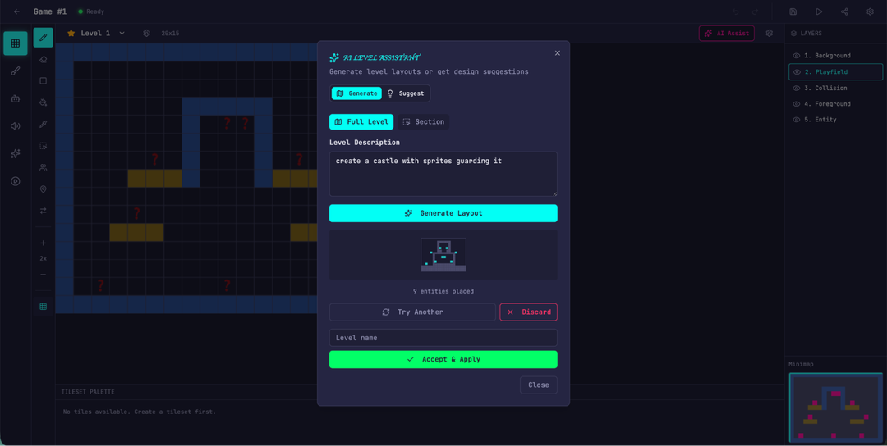
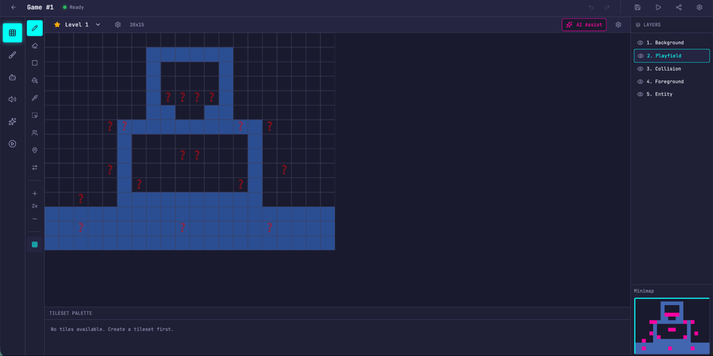
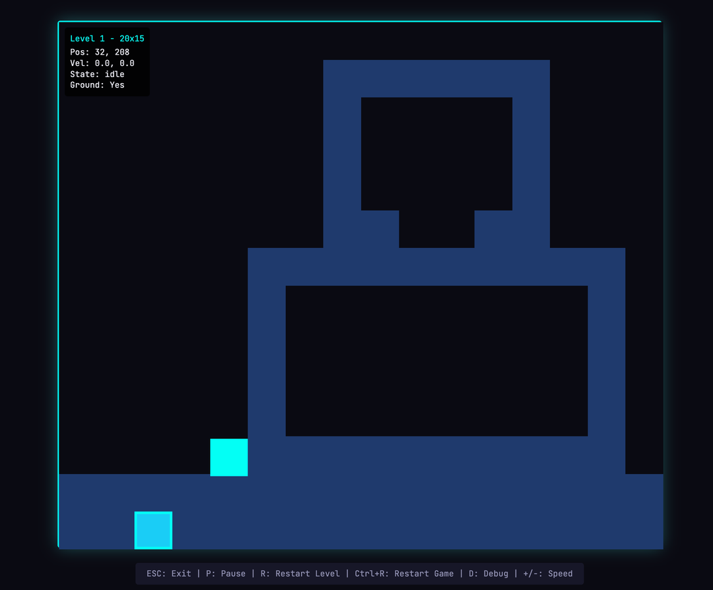

# 长时间运行应用开发的 Harness 设计

> 原文：[Harness design for long-running application development](https://www.anthropic.com/engineering/harness-design-long-running-apps)
> 来源：Anthropic Engineering | 2026-03-24
> 作者：Prithvi Rajasekaran

---

## 目录

- [引言：突破天花板](#引言突破天花板)
- [为什么朴素实现不够好](#为什么朴素实现不够好)
- [前端设计：让主观质量可评分](#前端设计让主观质量可评分)
- [扩展到全栈开发](#扩展到全栈开发)
- [运行 Harness：对比实验](#运行-harness对比实验)
- [迭代 Harness：简化与新模型](#迭代-harness简化与新模型)
- [更新后的 Harness 结果](#更新后的-harness-结果)
- [下一步](#下一步)

---

## 引言：突破天花板

过去几个月，作者一直在解决两个相互关联的问题：让 Claude 产出高质量的前端设计，以及让它在无人干预的情况下构建完整应用。这项工作源于早期在 [frontend design skill](https://github.com/anthropics/claude-code/blob/main/plugins/frontend-design/skills/frontend-design/SKILL.md) 和[长时间运行 coding agent harness](https://www.anthropic.com/engineering/effective-harnesses-for-long-running-agents) 上的努力——通过 prompt engineering 和 harness 设计将 Claude 的性能提升到远超基线，但两者最终都撞上了天花板。

为了突破，作者从 **GAN（生成对抗网络）** 中获得灵感，设计了一个包含 **generator（生成器）** 和 **evaluator（评估器）** 的多 agent 结构。构建一个能可靠评分——且有品味——的 evaluator，意味着首先要开发一套标准，将"这个设计好不好？"这样的主观判断转化为具体的、可评分的条目。

随后作者将这些技术应用到长时间自主编码中，沿用了早期 harness 工作的两个经验：将构建过程分解为可处理的块，以及用结构化 artifact 在 session 间传递上下文。最终成果是一个三 agent 架构——**planner、generator、evaluator**——在多小时的自主编码 session 中产出了丰富的全栈应用。

---

## 为什么朴素实现不够好

在[早期实验](https://www.anthropic.com/engineering/effective-harnesses-for-long-running-agents)中，团队用 initializer agent 将产品 spec 分解为任务列表，coding agent 一次实现一个功能，然后通过 artifact 在 session 间传递上下文。社区也收敛到了类似的洞察，比如 "[Ralph Wiggum](https://ghuntley.com/ralph/)" 方法用 hook 或脚本让 agent 持续迭代。

但对于更复杂的任务，agent 仍然会随时间偏离轨道。分解这个问题后，作者观察到两种常见的失败模式。

### 失败模式一：上下文窗口填满后失去连贯性

模型在长任务中随着上下文窗口填满而失去连贯性（参见[上下文工程](https://www.anthropic.com/engineering/effective-context-engineering-for-ai-agents)一文）。有些模型还表现出 **"context anxiety"（上下文焦虑）**——当它们认为接近上下文限制时，会过早地收尾工作。

**Context reset（上下文重置）** 解决了这两个问题：完全清空上下文窗口，启动一个全新 agent，配合结构化的 handoff 来传递前一个 agent 的状态和下一步。

这和 compaction（压缩）不同。Compaction 是原地总结早期对话让同一个 agent 继续，保留了连续性，但不给 agent 一个干净的起点——context anxiety 仍可能持续。Reset 提供干净的起点，代价是 handoff artifact 必须包含足够的状态让下一个 agent 能顺利接手。

在早期测试中，Claude Sonnet 4.5 的 context anxiety 严重到 compaction 不足以支撑长任务性能，context reset 成为 harness 设计的必要组件。代价是增加了编排复杂度、token 开销和延迟。

### 失败模式二：自我评估的偏见

当被要求评估自己产出的工作时，agent 倾向于自信地赞美——即使在人类观察者看来质量明显平庸。这个问题在设计这类主观任务上尤为突出，因为没有等价于可验证软件测试的二元检查。一个布局是精致还是平庸，是一个判断问题，而 agent 在评价自己的工作时可靠地偏向正面。

即使在有可验证结果的任务上，agent 有时也会表现出糟糕的判断力。**将做事的 agent 和评判的 agent 分开**，是解决这个问题的强力杠杆。分离本身不会立即消除宽容倾向——evaluator 仍然是一个倾向于对 LLM 生成内容宽容的 LLM。但调优一个独立的 evaluator 使其持怀疑态度，比让 generator 对自己的工作保持批判要容易得多。一旦外部反馈存在，generator 就有了具体的东西可以迭代。

---

## 前端设计：让主观质量可评分

作者从前端设计开始实验，因为自我评估问题在这里最明显。没有任何干预时，Claude 通常倾向于安全、可预测的布局——技术上能用但视觉上平庸。

两个洞察塑造了这个 harness：

1. 虽然美学不能完全还原为分数——个人品味总会有差异——但可以通过编码设计原则和偏好的评分标准来改进。"这个设计漂亮吗？"很难一致回答，但"这是否遵循了我们的好设计原则？"给了 Claude 具体的评分依据。
2. 将前端生成和前端评分分开，可以创建一个驱动 generator 产出更强输出的反馈循环。

### 四个评分标准

作者编写了四个评分标准，同时给到 generator 和 evaluator 的 prompt 中：

- **Design quality（设计质量）**：设计是否感觉像一个连贯的整体，而非零件的拼凑？强作品意味着颜色、排版、布局、图像等细节组合出独特的氛围和身份。
- **Originality（原创性）**：是否有自定义决策的证据，还是模板布局、库默认值和 AI 生成模式？人类设计师应该能识别出刻意的创意选择。未修改的库组件——或 AI 生成的典型标志如紫色渐变覆盖白色卡片——在这里不及格。
- **Craft（工艺）**：技术执行：排版层级、间距一致性、色彩和谐、对比度。这是能力检查而非创意检查。大多数合理的实现默认就能通过；不及格意味着基本功有问题。
- **Functionality（功能性）**：独立于美学的可用性。用户能否理解界面做什么、找到主要操作、完成任务而不用猜？

作者强调 design quality 和 originality 高于 craft 和 functionality——Claude 在后两者上默认就表现不错，因为所需的技术能力对模型来说是自然的。但在设计和原创性上，Claude 经常产出平淡的输出。标准明确惩罚高度通用的"AI slop"模式，通过更高权重推动模型承担更多美学风险。

作者还用 few-shot 示例和详细的评分分解来校准 evaluator，确保其判断与作者的偏好一致，减少跨迭代的评分漂移。

### 反馈循环

基于 [Claude Agent SDK](https://platform.claude.com/docs/en/agent-sdk/overview) 构建循环：

1. Generator 根据用户 prompt 创建 HTML/CSS/JS 前端
2. Evaluator 通过 **Playwright MCP** 与实际页面交互——自主导航、截图、仔细研究实现——然后对每个标准评分并写详细批评
3. 反馈流回 generator 作为下一次迭代的输入
4. 每次生成运行 5-15 次迭代

因为 evaluator 在主动导航页面而非评分静态截图，每个周期需要真实的时钟时间。完整运行可达四小时。作者还指示 generator 在每次评估后做战略决策：如果分数趋势良好就精炼当前方向，如果方法不奏效就转向完全不同的美学。

跨运行来看，evaluator 的评估在迭代中改善后趋于平稳，仍有提升空间。有些生成是渐进式精炼，有些则在迭代之间发生剧烈的美学转向。

标准的措辞以作者未完全预料到的方式引导了 generator。包含"最好的设计是博物馆级别的"这样的短语，将设计推向了特定的视觉收敛，表明与标准相关的 prompting 直接塑造了输出的特征。

虽然分数总体上随迭代改善，但模式并不总是线性的。后期实现整体上更好，但作者经常看到中间某次迭代比最后一次更好的情况。实现复杂度也倾向于跨轮次增加，generator 在 evaluator 反馈的推动下尝试更有野心的方案。即使在第一次迭代，输出就明显好于完全没有 prompting 的基线，表明标准和相关语言本身就在任何 evaluator 反馈之前将模型从通用默认值中引导出来。

### 一个惊人的例子

作者提示模型为一个荷兰艺术博物馆创建网站。到第九次迭代，产出了一个干净的深色主题着陆页——视觉上精致但基本在预期范围内。然后在第十个周期，它完全推翻了方案，将网站重新想象为一个空间体验：一个用 CSS 透视渲染的棋盘格地板 3D 房间，艺术品以自由形式挂在墙上，用门廊式导航在画廊房间之间切换。这是作者从未在单次生成中见过的创意飞跃。

---

## 扩展到全栈开发

有了这些发现，作者将这种 GAN 启发的模式应用到全栈开发。Generator-evaluator 循环自然映射到软件开发生命周期，其中代码审查和 QA 扮演与设计 evaluator 相同的结构角色。

### 架构

在早期的[长时间运行 harness](https://www.anthropic.com/engineering/effective-harnesses-for-long-running-agents) 中，团队用 initializer agent、一次一个功能的 coding agent 和 session 间的 context reset 来解决连贯的多 session 编码问题。Context reset 是关键突破：那个 harness 用的是 Sonnet 4.5，它表现出前面提到的"context anxiety"。而 Opus 4.5 基本上自己消除了这个行为，所以作者能够从这个 harness 中完全去掉 context reset。Agent 作为一个连续 session 跑完整个构建，由 [Claude Agent SDK](https://platform.claude.com/docs/en/agent-sdk/overview) 的自动 compaction 处理上下文增长。

在此基础上，作者构建了一个三 agent 系统，每个 agent 解决之前运行中观察到的特定缺口：

**Planner（规划器）：** 之前的 harness 要求用户预先提供详细 spec。作者想自动化这一步，创建了一个 planner agent，接受简单的 1-4 句 prompt 并扩展为完整产品 spec。提示它在范围上要有野心，专注于产品上下文和高层技术设计而非细粒度技术实现——如果 planner 试图预先指定细节并出错，spec 中的错误会级联到下游实现。更聪明的做法是约束 agent 要交付什么，让它们在工作中自己摸索路径。还要求 planner 寻找机会将 AI 功能编织进产品 spec。

**Generator（生成器）：** 沿用早期 harness 的一次一个功能方法来管理范围。指示 generator 以 sprint 方式工作，从 spec 中逐个拾取功能。每个 sprint 用 React、Vite、FastAPI 和 SQLite（后来是 PostgreSQL）栈实现，generator 在每个 sprint 结束时自我评估后交给 QA。还有 git 做版本控制。

**Evaluator（评估器）：** 早期 harness 产出的应用经常看起来很好但实际使用时有真实 bug。为了捕获这些，evaluator 用 **Playwright MCP** 像用户一样点击运行中的应用，测试 UI 功能、API 端点和数据库状态。然后根据发现的 bug 和一组标准（改编自前端实验，覆盖产品深度、功能性、视觉设计和代码质量）对每个 sprint 评分。每个标准有硬阈值，任何一个低于阈值，sprint 就失败，generator 获得详细反馈。

### Sprint 合同

每个 sprint 之前，generator 和 evaluator 协商一个 **sprint contract（sprint 合同）**：在写任何代码之前就"完成"的定义达成一致。这是因为产品 spec 故意保持高层，需要一个步骤来弥合用户故事和可测试实现之间的差距。Generator 提出要构建什么以及如何验证成功，evaluator 审查提案确保 generator 在构建正确的东西。两者迭代直到达成一致。

通信通过文件处理：一个 agent 写文件，另一个读取并在该文件内或用新文件回应。Generator 然后按照商定的合同构建，再交给 QA。这让工作忠实于 spec 而不会过早过度指定实现。

---

## 运行 Harness：对比实验

用 Claude Opus 4.5 运行，prompt 为：

> *Create a 2D retro game maker with features including a level editor, sprite editor, entity behaviors, and a playable test mode.*

| Harness | 时长 | 成本 |
|---------|------|------|
| Solo（单 agent） | 20 min | $9 |
| Full harness | 6 hr | $200 |

Harness 贵了 20 倍以上，但输出质量差异立即可见。

### Solo 运行的问题

作者期望一个可以构建关卡及其组件（精灵、实体、tile 布局）然后按下播放来实际玩关卡的界面。打开 solo 运行的输出，初始应用看起来符合预期。

*Solo harness 创建的应用初始界面*

但点击后问题开始浮现。布局浪费空间，固定高度的面板让大部分视口空着。工作流僵硬——试图填充关卡时提示先创建精灵和实体，但 UI 中没有任何东西引导用户走这个顺序。更关键的是——**游戏本身是坏的**。实体出现在屏幕上但不响应输入。挖掘代码发现实体定义和游戏运行时之间的连线是断的，表面上看不出问题在哪。

*Solo harness 中的 sprite 编辑器*

*尝试玩创建的关卡——失败*

### Harness 运行的优势

这个运行从同一句话 prompt 开始，但 planner 将其扩展为 16 个功能的 spec，分布在十个 sprint 中。远超 solo 运行的尝试范围。除了核心编辑器和游戏模式，spec 还包括精灵动画系统、行为模板、音效和音乐、AI 辅助精灵生成器和关卡设计器、游戏导出和分享链接。作者给了 planner 访问 [frontend design skill](https://github.com/anthropics/claude-code/blob/main/plugins/frontend-design/skills/frontend-design/SKILL.md) 的权限，planner 读取并用它为应用创建了视觉设计语言作为 spec 的一部分。对于每个 sprint，generator 和 evaluator 协商合同，定义具体的实现细节和用于验证完成的可测试行为。

*Full harness 创建的应用初始界面*

应用立即展现出比 solo 运行更多的打磨和流畅度。画布使用了完整视口，面板大小合理，界面有一致的视觉身份，跟踪了 spec 中的设计方向。Solo 运行中的一些笨拙感仍然存在——工作流仍然没有明确告诉你应该先构建精灵和实体再填充关卡，得自己摸索。这读起来像是基础模型产品直觉的缺口，而非 harness 设计要解决的问题，不过它确实暗示了 harness 内部定向迭代可以进一步提升输出质量的地方。

深入编辑器后，新运行相对 solo 的优势更加明显。Sprite 编辑器更丰富、功能更完整，有更干净的工具面板、更好的颜色选择器和更可用的缩放控件。

*Full harness 中的 sprite 编辑器——更干净、更易用*

因为要求 planner 编织 AI 功能，应用还内置了 Claude 集成，可以通过 prompt 生成游戏的不同部分，显著加速了工作流。

*用内置 AI 功能生成关卡*

*用内置 AI 功能生成关卡*

**最大的差异在游戏模式**——实际上能移动实体并玩游戏。物理有些粗糙边缘——角色跳上平台后与平台重叠，直觉上感觉不对——但核心功能工作了，而 solo 运行完全没做到。移动一会儿后确实碰到了 AI 关卡构建的一些限制——有一面大墙跳不过去，被卡住了。这暗示 harness 可以处理一些常识性改进和边缘情况来进一步精炼应用。

*玩生成的游戏——核心功能工作了*

### Evaluator 的具体发现

从日志中可以清楚看到 evaluator 让实现与 spec 保持一致。每个 sprint，它遍历 sprint 合同的测试标准，通过 Playwright 操作运行中的应用，对任何偏离预期行为的地方提 bug。合同很细粒度——Sprint 3 单独就有 27 个标准覆盖关卡编辑器——evaluator 的发现足够具体，可以直接行动而不需要额外调查：

| 合同标准 | Evaluator 发现 |
|----------|---------------|
| 矩形填充工具允许点击拖拽用选中的 tile 填充矩形区域 | **FAIL** — 工具只在拖拽起止点放置 tile 而非填充区域。`fillRectangle` 函数存在但在 mouseUp 时未正确触发。 |
| 用户可以选择和删除已放置的实体生成点 | **FAIL** — `LevelEditor.tsx:892` 的 Delete 键处理器要求 `selection` 和 `selectedEntityId` 都被设置，但点击实体只设置了 `selectedEntityId`。条件应为 `selection \|\| (selectedEntityId && activeLayer === 'entity')`。 |
| 用户可以通过 API 重排动画帧 | **FAIL** — `PUT /frames/reorder` 路由定义在 `/{frame_id}` 路由之后。FastAPI 将 'reorder' 匹配为 frame_id 整数并返回 422。 |

### 调优 Evaluator 的困难

开箱即用的 Claude 是一个糟糕的 QA agent。在早期运行中，作者看到它识别出合理的问题，然后说服自己这些不是大问题并批准工作。它也倾向于表面测试而非探测边缘情况，所以更微妙的 bug 经常溜过去。

调优循环：读 evaluator 的日志，找到其判断与作者判断分歧的例子，更新 QA 的 prompt 来解决这些问题。经过几轮开发循环后，evaluator 才以作者认为合理的方式评分。即便如此，harness 输出仍然展示了模型 QA 能力的局限：小的布局问题、某些地方不直觉的交互、以及 evaluator 没有深入测试的嵌套功能中未发现的 bug。显然还有更多验证空间可以通过进一步调优来捕获。但与 solo 运行——应用的核心功能根本不工作——相比，提升是显而易见的。

---

## 迭代 Harness：简化与新模型

第一版 harness 结果令人鼓舞，但笨重、慢、贵。下一步是找到简化方式而不降低性能。这部分是常识，部分是一个更一般原则的体现：**harness 中的每个组件都编码了一个关于模型不能自己做什么的假设，这些假设值得压力测试**——因为它们可能不正确，也因为随着模型改进它们会很快过时。[Building Effective Agents](https://www.anthropic.com/research/building-effective-agents) 将底层思想表述为"找到最简单的可能解决方案，只在需要时增加复杂度"，这是任何维护 agent harness 的人都会反复遇到的模式。

作者第一次尝试简化时，大幅削减了 harness 并尝试了一些创造性的新想法，但无法复现原版的性能。也变得难以分辨 harness 设计的哪些部分实际上是承重的，以及以什么方式承重。基于这个经验，作者转向更系统的方法：一次移除一个组件，审查它对最终结果的影响。

在经历这些迭代周期时，Opus 4.6 也发布了，进一步推动了减少 harness 复杂度的动机。有充分理由预期 4.6 比 4.5 需要更少的脚手架。从[发布博客](https://www.anthropic.com/news/claude-opus-4-6)来看："[Opus 4.6] 规划更仔细，能更长时间维持 agentic 任务，在更大代码库中更可靠地运行，有更好的代码审查和调试技能来捕获自己的错误。"它在长上下文检索上也有实质性改进。这些都是 harness 曾经被构建来补充的能力。

### 移除 Sprint 结构

作者完全移除了 sprint 结构。Sprint 结构曾帮助将工作分解为模型能连贯处理的块。鉴于 Opus 4.6 的改进，有充分理由相信模型可以原生处理这项工作而不需要这种分解。

保留了 planner 和 evaluator，因为两者仍然有明显价值。没有 planner，generator 会低估范围：给它原始 prompt，它会直接开始构建而不先做 spec，最终创建出功能不如 planner 版本丰富的应用。

移除 sprint 结构后，evaluator 移到运行结束时做单次评估而非每个 sprint 评分。因为模型更有能力了，这改变了 evaluator 在某些运行中的承重程度——它的有用性取决于任务相对于模型能可靠独立完成的范围在哪里。在 4.5 上，构建处于 generator 能独立做好的边缘，evaluator 在整个构建中捕获有意义的问题。在 4.6 上，模型原始能力增加，边界外移。曾经需要 evaluator 检查才能连贯实现的任务，现在往往在 generator 独立处理的范围内。但对于仍处于 generator 能力边缘的构建部分，evaluator 继续提供真实的提升。

**实际含义：evaluator 不是固定的是/否决策。当任务超出当前模型能可靠独立完成的范围时，它才值得成本。**

除了结构简化，作者还添加了 prompting 来改进 harness 如何将 AI 功能构建进每个应用——具体来说是让 generator 构建一个能通过工具驱动应用自身功能的正式 agent。这需要真正的迭代，因为相关知识足够新，Claude 的训练数据覆盖得很薄。但经过足够的调优，generator 能正确地构建 agent 了。

---

## 更新后的 Harness 结果

Prompt：

> *Build a fully featured DAW in the browser using the Web Audio API.*

运行仍然漫长且昂贵——大约 4 小时，$124 的 token 成本。大部分时间花在 builder 上，它连贯运行了超过两小时——不需要 Opus 4.5 所需的 sprint 分解。

| Agent & Phase | 时长 | 成本 |
|---------------|------|------|
| Planner | 4.7 min | $0.46 |
| Build (Round 1) | 2 hr 7 min | $71.08 |
| QA (Round 1) | 8.8 min | $3.24 |
| Build (Round 2) | 1 hr 2 min | $36.89 |
| QA (Round 2) | 6.8 min | $3.09 |
| Build (Round 3) | 10.9 min | $5.88 |
| QA (Round 3) | 9.6 min | $4.06 |
| **Total V2 Harness** | **3 hr 50 min** | **$124.70** |

和之前的 harness 一样，planner 将一行 prompt 扩展为完整 spec。从日志中可以看到 generator 在规划应用和 agent 设计、连接 agent、测试后交给 QA 方面做得很好。

### QA 仍然有价值

尽管如此，QA agent 仍然捕获了真实的缺口。第一轮 QA 反馈：

> 这是一个强大的应用，设计保真度出色，AI agent 扎实，后端良好。主要失败点是功能完整性——虽然应用看起来令人印象深刻且 AI 集成工作良好，但几个核心 DAW 功能只是展示而没有交互深度：clip 不能在时间线上拖拽/移动，没有乐器 UI 面板（合成器旋钮、鼓垫），没有可视化效果编辑器（EQ 曲线、压缩器仪表）。这些不是边缘情况——它们是让 DAW 可用的核心交互，spec 明确要求了它们。

第二轮 QA 反馈：

> 剩余差距：
> - 音频录制仍然只是 stub（按钮切换但没有麦克风捕获）
> - Clip 边缘拖拽调整大小和 clip 分割未实现
> - 效果可视化是数字滑块，不是图形化的（没有 EQ 曲线）

Generator 在独自工作时仍然容易遗漏细节或 stub 功能，QA 在捕获这些最后一英里问题上仍有价值。

最终应用远非专业音乐制作程序，agent 的歌曲创作技能显然还需要大量工作。此外 Claude 实际上听不到声音，这让 QA 反馈循环在音乐品味方面效果较差。

但最终应用有一个功能性音乐制作程序的所有核心部件：工作的编排视图、混音器和传输在浏览器中运行。通过 prompt 完成了一个简短的歌曲片段：agent 设置了节拍和调性，铺设了旋律，构建了鼓轨，调整了混音器电平，添加了混响。歌曲创作的核心原语都在，agent 能自主驱动它们，用工具从头到尾创建一个简单的制作。

---

## 下一步

随着模型持续改进，我们大致可以预期它们能工作更长时间、处理更复杂的任务。在某些情况下，模型周围的脚手架会随时间变得不那么重要，开发者可以等下一个模型看某些问题自己解决。另一方面，模型越好，开发能实现超出模型基线能力的复杂任务的 harness 的空间就越大。

几个值得带走的经验：

1. **始终实验**：对你正在构建的模型进行实验，在真实问题上读它的 trace，调优性能以达到期望结果。
2. **分解复杂任务**：有时通过分解任务并对问题的每个方面应用专门化 agent 可以获得提升空间。
3. **新模型到来时重新审视 harness**：剥离不再对性能有承重作用的部分，添加新部分以实现之前不可能的更大能力。

**作者的信念：有趣的 harness 组合空间不会随着模型改进而缩小。相反，它在移动，AI 工程师的有趣工作是不断找到下一个新颖的组合。**

---

*致谢：特别感谢 Mike Krieger、Michael Agaby、Justin Young、Jeremy Hadfield、David Hershey、Julius Tarng、Xiaoyi Zhang、Barry Zhang、Orowa Sidker、Michael Tingley、Ibrahim Madha、Martina Long 和 Canyon Robbins 对这项工作的贡献。感谢 Jake Eaton、Alyssa Leonard 和 Stef Sequeira 帮助塑造这篇文章。*
