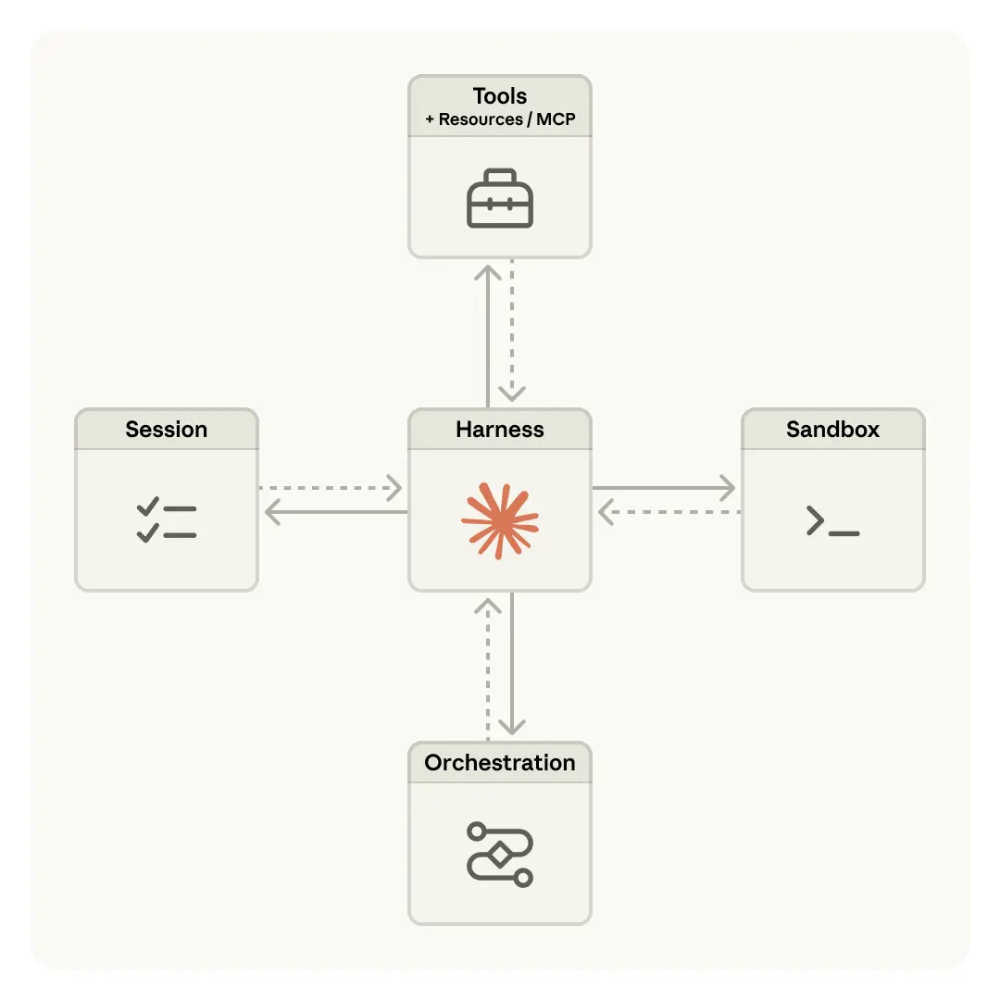
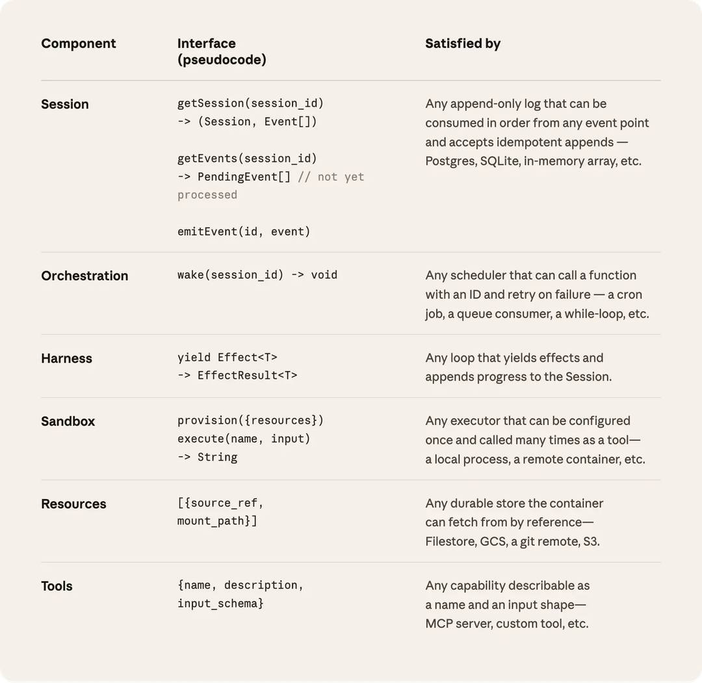
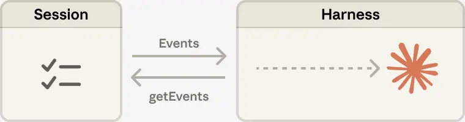
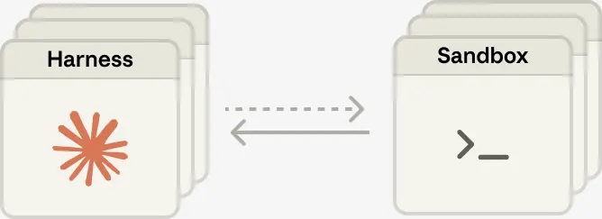

# Scaling Managed Agents：解耦大脑与双手

> 原文：[Scaling Managed Agents: Decoupling the brain from the hands](https://www.anthropic.com/engineering/managed-agents)
> 来源：Anthropic Engineering · 2026-04-08
> 作者：Lance Martin, Gabe Cemaj, Michael Cohen

---

## 目录

- [引言：Harness 的假设会过时](#引言harness-的假设会过时)
- [Managed Agents 是什么](#managed-agents-是什么)
- [别养宠物](#别养宠物)
- [解耦大脑与双手](#解耦大脑与双手)
- [Session 不是 Claude 的上下文窗口](#session-不是-claude-的上下文窗口)
- [多个大脑，多双手](#多个大脑多双手)
- [结论](#结论)

---

## 引言：Harness 的假设会过时

*可以通过 [官方文档](https://platform.claude.com/docs/en/managed-agents/overview) 开始使用 Claude Managed Agents。*

我们在工程博客上反复讨论的一个主题是：如何[构建有效的 agent](https://www.anthropic.com/engineering/building-effective-agents)，如何为[长时间运行的工作](https://www.anthropic.com/engineering/harness-design-long-running-apps)设计 [harness](https://www.anthropic.com/engineering/effective-harnesses-for-long-running-agents)（agent 的外部控制框架）。这些工作有一条共同线索——**harness 里写死了"Claude 自己做不到 X"这样的假设**。但这些假设需要不断被质疑，因为模型在进步，假设很快就会[过时](http://www.incompleteideas.net/IncIdeas/BitterLesson.html)。

举个例子：在之前的工作中，[我们发现](https://www.anthropic.com/engineering/harness-design-long-running-apps) Claude Sonnet 4.5 在感知到上下文窗口快满时会提前结束任务——一种被称为"**context anxiety**"的行为。我们在 harness 中加入了 context reset 来解决这个问题。但当我们把同一个 harness 用在 Claude Opus 4.5 上时，发现这个行为已经消失了。那些 reset 变成了多余的死代码。

我们预期 harness 会持续演化。所以我们构建了 **Managed Agents**：Claude Platform 上的一个托管服务，通过一小组设计上比任何具体实现都更持久的稳定接口，代你运行长周期 agent——包括我们今天跑的那些实现本身，未来也可能被换掉。

---

## Managed Agents 是什么

构建 Managed Agents 意味着要解决计算领域的一个老问题：如何为"[还没被想出来的程序](http://www.catb.org/esr/writings/taoup/html/ch03s01.html)"设计系统。几十年前，操作系统通过将硬件虚拟化为抽象概念——**进程、文件**——来解决这个问题，这些抽象足够通用，能服务于当时还不存在的程序。抽象比硬件活得更久。`read()` 命令不关心底层是 1970 年代的磁盘组还是现代 SSD。上层抽象保持稳定，底层实现自由更换。

Managed Agents 遵循同样的模式。我们将 agent 的组件虚拟化为三个接口：

- **Session**（会话）：一个 append-only 的事件日志，记录所有发生过的事情
- **Harness**（控制框架）：调用 Claude 并将 Claude 的 tool call 路由到相关基础设施的循环
- **Sandbox**（沙箱）：Claude 可以运行代码和编辑文件的执行环境

这样每个组件的实现都可以被替换，而不影响其他组件。**我们对这些接口的形状有明确主张，但不关心接口背后跑的是什么。**

---

## 别养宠物

我们最初把所有 agent 组件放进一个容器里——session、harness、sandbox 共享同一个环境。这样做有好处：文件编辑就是直接的系统调用，不需要设计服务边界。

但把所有东西耦合进一个容器，我们撞上了一个老问题：我们养了一只[**宠物**](https://cloudscaling.com/blog/cloud-computing/the-history-of-pets-vs-cattle/)。在 pets-vs-cattle 的类比中，宠物是有名字的、需要精心照料的个体，丢不起；而牲畜是可互换的消耗品。在我们的场景里，服务器变成了那只宠物——容器挂了，session 就丢了；容器无响应，我们得把它"救活"。

"救活"容器意味着调试无响应的卡死 session。我们唯一的观察窗口是 WebSocket 事件流，但它无法告诉我们**故障发生在哪里**——harness 的 bug、事件流的丢包、容器下线，呈现出来的症状完全一样。要搞清楚出了什么问题，工程师得打开容器内部的 shell，但因为那个容器通常还持有用户数据，这意味着我们实际上丧失了调试能力。

第二个问题：harness 假设 Claude 操作的东西就在容器里。当客户要求把 Claude 连接到他们的 VPC 时，他们要么把网络和我们做 peering（对等互联），要么在自己的环境里运行我们的 harness。一个写死在 harness 里的假设，在我们想连接不同基础设施时变成了障碍。

---

## 解耦大脑与双手

我们最终的方案是把"**大脑**"（Claude 和它的 harness）从"**双手**"（执行动作的 sandbox 和工具）以及"**session**"（事件日志）中解耦出来。每个部分变成一个接口，对其他部分做最少的假设，可以独立失败或被替换。

**Harness 离开容器。** 解耦大脑与双手意味着 harness 不再住在容器里。它调用容器的方式和调用任何其他工具一样：`execute(name, input) → string`。容器变成了牲畜——坏了就换，不用心疼。容器挂了，harness 把失败当作 tool-call error 传回给 Claude。如果 Claude 决定重试，一个新容器可以用标准配方重新初始化：`provision({resources})`。我们不再需要把挂掉的容器救活。

**从 harness 故障中恢复。** Harness 本身也变成了牲畜。因为 session 日志存在 harness 外面，harness 里没有任何东西需要在崩溃中存活。一个新 harness 可以通过 `wake(sessionId)` 启动，用 `getSession(id)` 拿回事件日志，从最后一个事件恢复。在 agent 循环中，harness 通过 `emitEvent(id, event)` 写入 session，保持事件的持久记录。

**安全边界。** 在耦合设计中，Claude 生成的任何不可信代码都在持有凭证的同一个容器里运行——所以一次 prompt injection 只需要说服 Claude 读取自己的环境变量。一旦攻击者拿到那些 token，就能创建全新的、不受限的 session 并把工作委派给它们。缩小 token 权限是一个显而易见的缓解措施，但这又编码了一个假设——"Claude 用有限 token 做不了什么"——而 Claude 正在变得越来越聪明。**结构性的修复是确保 token 永远无法从 Claude 生成代码运行的 sandbox 中被访问到。**

我们用了两种模式来实现这一点：

- **Git**：用仓库的 access token 在 sandbox 初始化时 clone 代码，并写入本地 git remote。sandbox 内部的 git push/pull 正常工作，但 agent 从不直接接触 token。
- **自定义工具（MCP）**：OAuth token 存在安全 vault 中。Claude 通过专用代理调用 MCP 工具；代理接收与 session 关联的 token，从 vault 获取对应凭证，再调用外部服务。Harness 永远不知道任何凭证的存在。

---

## Session 不是 Claude 的上下文窗口

长周期任务经常超出 Claude 的上下文窗口长度，标准的应对方式都涉及**不可逆的决策**——保留什么、丢弃什么。我们在[之前的工作](https://www.anthropic.com/engineering/effective-context-engineering-for-ai-agents)中探索过这些 context engineering 技术。比如 compaction 让 Claude 保存上下文摘要，memory tool 让 Claude 把上下文写入文件实现跨 session 学习，context trimming 选择性移除旧的 tool result 或 thinking block。

但选择性保留或丢弃上下文的不可逆决策会导致失败。**很难知道未来的对话轮次需要哪些 token。** 如果消息被 compaction 步骤转换了，harness 会从 Claude 的上下文窗口中移除被压缩的消息，这些消息只有在被存储的情况下才可恢复。之前的[研究](https://arxiv.org/pdf/2512.24601)探索了一种方式：把上下文存储为一个**活在上下文窗口之外的对象**，LLM 通过写代码来程序化地访问它——过滤、切片。

在 Managed Agents 中，session 提供了同样的好处——作为一个活在 Claude 上下文窗口之外的 context 对象。但它不是存在 sandbox 或 REPL 里，而是持久存储在 session 日志中。接口 `getEvents()` 允许大脑通过选择事件流的位置切片来查询上下文。这个接口使用灵活：大脑可以从上次停止阅读的地方继续，可以在某个特定时刻之前倒回几个事件看前因，也可以在某个特定动作之前重新阅读上下文。

获取到的事件还可以在 harness 中被转换后再传入 Claude 的上下文窗口。这些转换可以是 harness 编码的任何逻辑，包括为了实现高 prompt cache 命中率而做的上下文组织，以及各种 context engineering。我们把**可恢复的上下文存储**（在 session 中）和**任意的上下文管理**（在 harness 中）分离开来，因为我们无法预测未来模型需要什么样的 context engineering。接口把上下文管理推入 harness，只保证 session 是持久的、可查询的。

---

## 多个大脑，多双手

**多个大脑。** 解耦大脑与双手解决了我们最早的客户投诉之一。当团队想让 Claude 操作他们自己 VPC 中的资源时，唯一的路径是网络对等互联，因为持有 harness 的容器假设所有资源都在它旁边。一旦 harness 不再在容器里，这个假设就消失了。

同样的改变还带来了性能收益。最初把大脑放在容器里，意味着多个大脑需要同样多的容器。对每个大脑来说，在容器 provision 完成之前不能做任何推理；每个 session 都要预付完整的容器启动成本。每个 session——即使是那些永远不会碰 sandbox 的——都得 clone 代码、启动进程、从服务器拉取待处理事件。

这些死时间体现在 **TTFT**（time-to-first-token，首 token 延迟）上——用户从提交任务到看到第一个响应 token 的等待时间。TTFT 是用户最直接**感受到**的延迟。

解耦后，容器只在需要时才由大脑通过 tool call（`execute(name, input) → string`）来 provision。不需要容器的 session 不用等容器。推理可以在 orchestration layer（编排层）从 session 日志拉取待处理事件后立即开始。用这个架构，**我们的 p50 TTFT 下降了约 60%，p95 下降了超过 90%**。扩展到多个大脑只需要启动多个无状态 harness，按需连接到 hands。

**多双手。** 我们还希望每个大脑能连接多双手。实际上这意味着 Claude 必须推理多个执行环境并决定把工作发到哪里——比在单个 shell 中操作更难的认知任务。我们最初把大脑放在单个容器里，因为早期模型做不到这一点。随着智能提升，单容器反而变成了瓶颈：那个容器挂了，大脑正在操作的所有 hands 的状态都丢了。

解耦后，每只手就是一个工具，`execute(name, input) → string`：名字和输入进去，字符串出来。这个接口支持任何自定义工具、任何 MCP server、以及我们自己的工具。**Harness 不关心 sandbox 是容器、手机还是 Pokémon 模拟器。** 而且因为没有 hand 耦合到任何 brain，brain 之间可以互相传递 hands。

---

## 结论

我们面对的挑战是一个老问题：如何为"还没被想出来的程序"设计系统。操作系统通过将硬件虚拟化为足够通用的抽象，存活了几十年。Managed Agents 的目标是设计一个能容纳未来 harness、sandbox 或其他围绕 Claude 的组件的系统。

Managed Agents 是一个 **meta-harness**——对 Claude 未来需要什么*具体* harness 不持立场，而是提供通用接口来容纳多种不同的 harness。比如 Claude Code 是一个优秀的 harness，我们在各种任务中广泛使用。我们也展示过针对特定任务的 agent harness 在窄领域表现出色。Managed Agents 可以容纳所有这些，随着 Claude 智能的提升而匹配。

Meta-harness 设计意味着对 Claude 周围的接口持有明确主张：我们预期 Claude 需要操作状态的能力（session）和执行计算的能力（sandbox）。我们也预期 Claude 需要扩展到多个大脑和多双手的能力。我们设计的接口让这些能力可以在长时间跨度内可靠、安全地运行。**但我们不假设 Claude 需要多少个大脑或多少双手，也不假设它们在哪里。**

---

*致谢：Lance Martin、Gabe Cemaj、Michael Cohen 撰写。感谢 Nodir Turakulov 和 Jeremy Fox 在这些话题上的有益讨论。特别感谢 Agents API 团队和 Jake Eaton 的贡献。*
