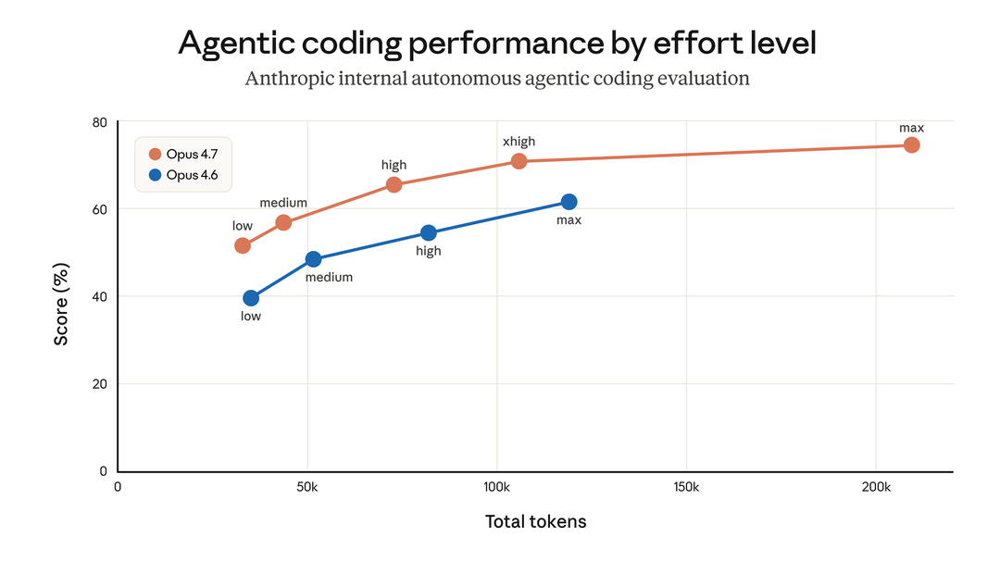
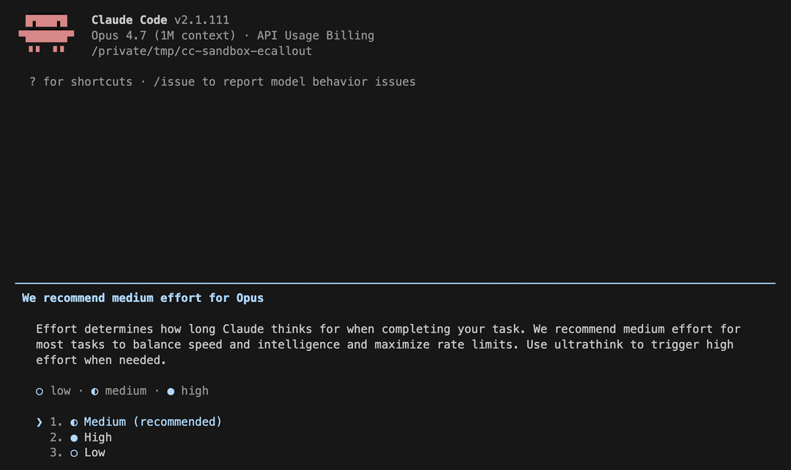
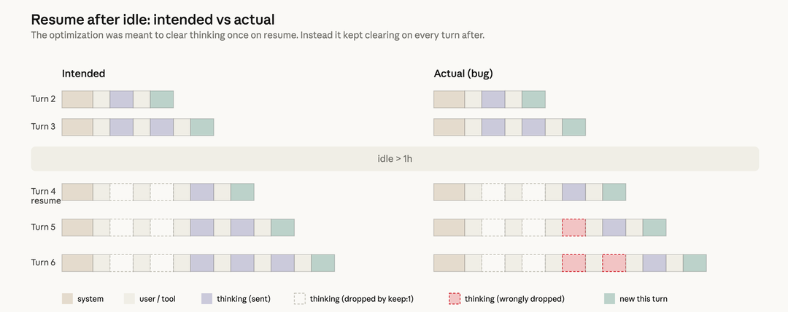

# 近期 Claude Code 质量问题更新

> 原文：[An update on recent Claude Code quality reports](https://www.anthropic.com/engineering/april-23-postmortem)
> 来源：Anthropic Engineering | 2026-04-23
> 作者：Anthropic

---

## 索引

- [概述](#概述)
- [问题一：默认推理力度被调低](#问题一默认推理力度被调低)
- [问题二：缓存优化导致推理历史丢失](#问题二缓存优化导致推理历史丢失)
- [问题三：系统提示词限制冗长度](#问题三系统提示词限制冗长度)
- [后续改进](#后续改进)

---

## 概述

过去一个月，Anthropic 一直在调查用户反馈的"Claude 回复质量下降"问题。最终追溯到**三个独立的变更**，分别影响了 Claude Code、Claude Agent SDK 和 Claude Cowork。API 层未受影响。

三个问题已于 4 月 20 日（v2.1.116）全部修复。

Anthropic 强调：**从未故意降低模型质量**，API 和推理层经确认未受影响。

三个问题分别是：

1. **3 月 4 日**：将 Claude Code 默认推理力度（reasoning effort）从 `high` 改为 `medium`，导致智能下降。4 月 7 日回滚。影响 Sonnet 4.6 和 Opus 4.6。
2. **3 月 26 日**：一个缓存优化 bug 导致每轮对话都清除历史推理，使 Claude 表现出"健忘"和重复。4 月 10 日修复。影响 Sonnet 4.6 和 Opus 4.6。
3. **4 月 16 日**：系统提示词中新增了限制冗长度的指令，与其他 prompt 变更叠加后损害了编码质量。4 月 20 日回滚。影响 Sonnet 4.6、Opus 4.6 和 Opus 4.7。

因为三个变更影响的流量切片和时间表各不相同，叠加起来看起来像是**广泛且不一致的退化**。早期调查中，这些问题难以与正常的用户反馈波动区分开来，内部使用和 eval 也未能复现。

---

## 问题一：默认推理力度被调低

2 月发布 Opus 4.6 时，Claude Code 的默认推理力度设为 `high`。

随后收到反馈：`high` 模式下 Opus 4.6 偶尔会思考过久，导致 UI 看起来像卡死，延迟和 token 消耗不成比例。

**核心权衡**：模型思考越久，输出越好。Effort level 是用户在"更多思考"和"更低延迟 + 更少用量消耗"之间做选择的机制。团队在 test-time-compute 曲线上选取若干点，作为不同 effort 级别的选项，然后在产品层决定默认值，通过 Messages API 的 effort 参数发送，其他选项通过 `/effort` 命令暴露。

内部 eval 显示 `medium` 在大多数任务上智能略低但延迟显著降低，也没有长尾延迟问题，还能帮用户省用量。于是将默认值改为 `medium`，并通过产品内对话框解释了理由。

上线后用户开始反馈 Claude Code "变笨了"。团队做了多轮设计迭代来让当前 effort 设置更明显（启动提示、内联 effort 选择器、恢复 ultrathink），但大多数用户保留了 `medium` 默认值。

听取更多客户反馈后，4 月 7 日回滚了这个决定。现在所有用户默认：Opus 4.7 用 `xhigh`，其他模型用 `high`。

---

## 问题二：缓存优化导致推理历史丢失

Claude 推理时，推理过程通常保留在对话历史中，这样后续每轮 Claude 都能看到自己之前为什么做了那些编辑和 tool call。

3 月 26 日上线了一个效率优化。Claude Code 使用 **prompt caching** 让连续 API 调用更便宜更快。Claude 在发起 API 请求时将 input token 写入缓存，一段时间不活跃后 prompt 被驱逐出缓存。

**设计意图**：如果 session 空闲超过一小时，反正缓存已经 miss 了，不如趁机清除旧的 thinking section 来减少 uncached token 数量，降低用户恢复 session 的成本。之后恢复发送完整推理历史。实现方式是使用 `clear_thinking_20251015` API header 配合 `keep:1`。

**Bug**：本应只清除一次，实际上在 session 越过空闲阈值后，**每一轮都在清除**。每次请求都告诉 API 只保留最近一个 thinking block、丢弃之前所有的。更糟的是：如果你在 Claude 执行 tool use 的过程中发了一条消息，那会在 broken flag 下开启新一轮，连当前轮的推理也被丢掉了。Claude 继续执行，但**越来越不记得自己为什么要做当前的事**。这就是用户报告的健忘、重复和奇怪 tool 选择的根源。

因为持续丢弃 thinking block 导致后续请求也都是 cache miss，这也解释了用户反馈的"用量消耗比预期快得多"。

两个无关的实验增加了复现难度：一个内部 server-side 消息队列实验，以及一个 thinking 显示方式的变更在大多数 CLI session 中抑制了这个 bug，导致测试外部 build 时也没抓到。

这个 bug 处于 Claude Code 上下文管理、Anthropic API 和 extended thinking 的**交叉地带**。它通过了多轮人工和自动化代码审查、单元测试、端到端测试、自动验证和 dogfooding。加上只在 corner case（stale session）中触发且难以复现，花了一周多才确认根因。

调查中，团队用 Opus 4.7 对问题 PR 做了 Code Review 回测。**给定完整代码仓库上下文时，Opus 4.7 找到了这个 bug，而 Opus 4.6 没有**。为防止类似问题，现在正在为 Code Review 增加对额外仓库作为上下文的支持。

4 月 10 日在 v2.1.101 中修复。

---

## 问题三：系统提示词限制冗长度

Opus 4.7 相比前代有一个显著行为特征：**更冗长**。这让它在难题上更聪明，但也产生更多 output token。

发布 Opus 4.7 前几周，团队开始调优 Claude Code 的 harness 和产品。减少冗长度的手段包括：模型训练、prompting、改进 thinking UX。最终都用了，但系统提示词中的一条指令对智能产生了过大影响：

> "Length limits: keep text between tool calls to ≤25 words. Keep final responses to ≤100 words unless the task requires more detail."

经过数周内部测试且在已有 eval 集上无回归后，4 月 16 日随 Opus 4.7 一起上线。

调查中跑了更多 ablation（逐行移除系统提示词来理解每行的影响），使用更广泛的 eval 集。其中一个 eval 显示 Opus 4.6 和 4.7 都有 **3% 的下降**。立即在 4 月 20 日的发布中回滚了这条 prompt。

---

## 后续改进

1. **确保更多内部员工使用完全相同的公开版本**（而非用于测试新功能的内部版本）
2. **改进 Code Review 工具**并将改进版发布给客户
3. **收紧系统提示词变更的控制**：
   - 每次 prompt 变更都跑全面的 per-model eval
   - 持续做 ablation 理解每行的影响
   - 新工具让 prompt 变更更易审查和审计
   - CLAUDE.md 中增加指导，确保 model-specific 变更只针对特定模型生效
   - 任何可能影响智能的变更都增加 soak period、更广泛的 eval 集和渐进式发布
4. 创建 **@ClaudeDevs** 账号解释产品决策，同时在 GitHub 集中发布更新
5. 为所有订阅者**重置用量限制**作为补偿
