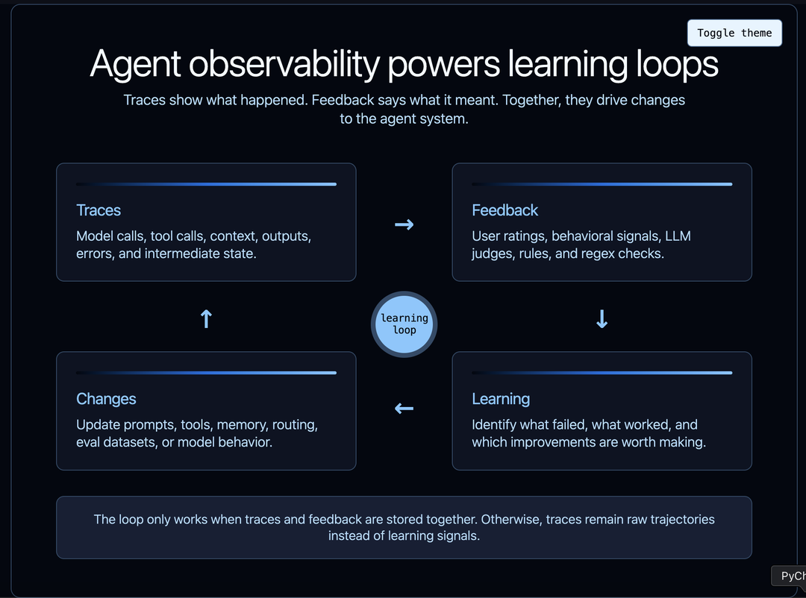
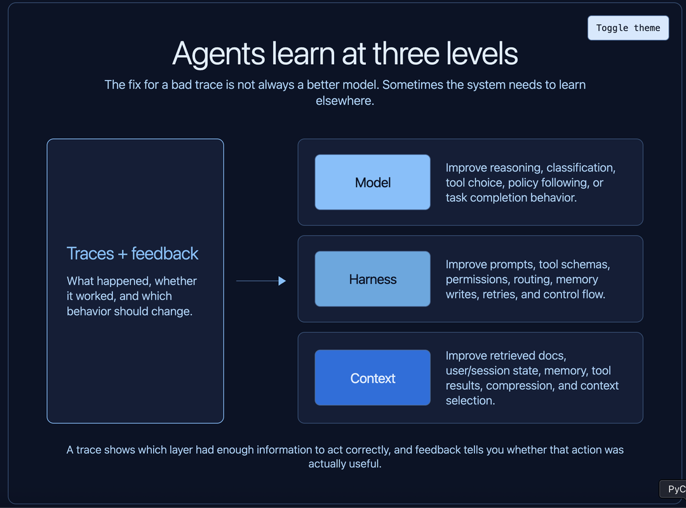
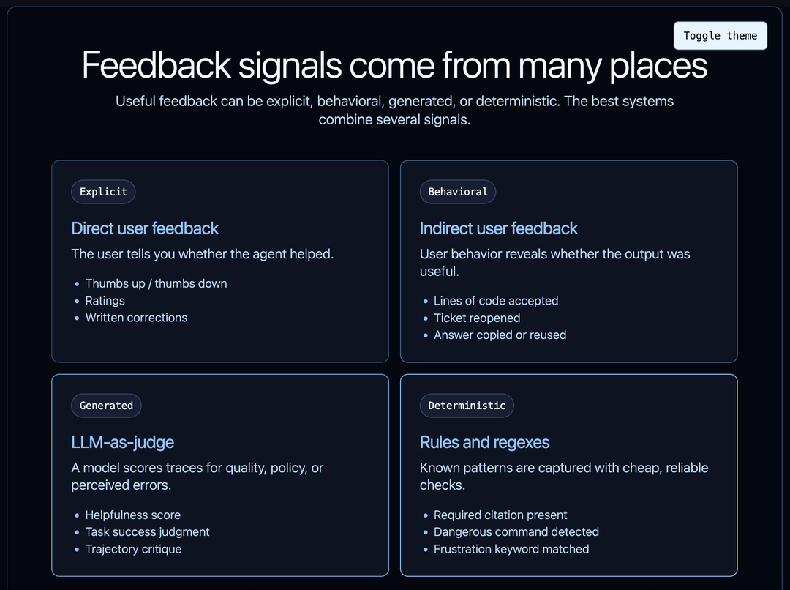
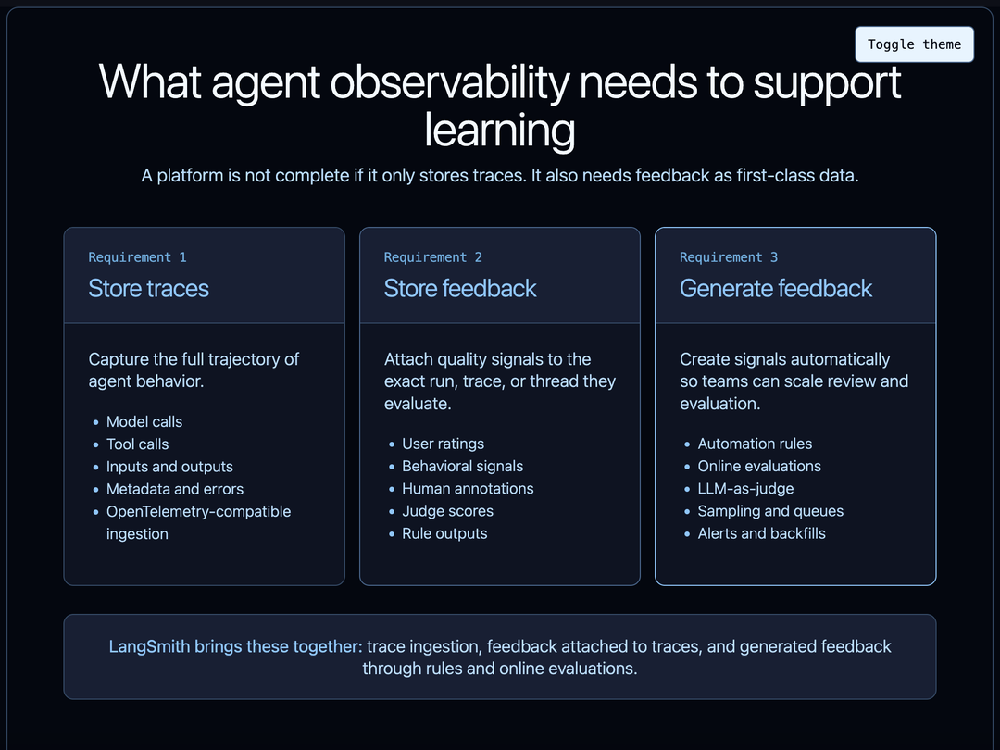

# Agent 可观测性需要反馈来驱动学习

> 原文：[Agent Observability Needs Feedback to Power Learning](https://www.langchain.com/blog/agent-observability-needs-feedback-to-power-learning)
> 来源：LangChain Blog | 2026-04-01
> 作者：LangChain

---

## 目录

- [可观测性的真正角色](#可观测性的真正角色)
- [学习发生在多个层面](#学习发生在多个层面)
- [学习可以自动化也可以手动](#学习可以自动化也可以手动)
- [Trace 是必要的但不充分](#trace-是必要的但不充分)
- [反馈可以来自很多地方](#反馈可以来自很多地方)
- [可观测性平台需要什么](#可观测性平台需要什么)
- [学习循环依赖 Trace + 反馈](#学习循环依赖-trace--反馈)

---

## 可观测性的真正角色

大多数团队开始思考 agent 可观测性时，把它当作调试工具。出了问题，打开 trace，检查步骤，找出 agent 在哪里做了错误决策。

这有用，但太狭隘了。

Agent 可观测性更深层的角色是**驱动学习**。但 trace 本身不能创造这个循环。你还需要反馈——告诉你 agent 的行为是有用的、被接受的、被拒绝的、低效的、有风险的还是错误的信号。

这里的"学习"不仅是模型训练意义上的学习，而是整个 agent 系统的学习：模型应该做什么、harness 应该如何引导它、它需要什么上下文、哪些失败模式在反复出现、哪些行为实际上对用户有效。

Trace 不仅仅是发生了什么的记录，反馈也不仅仅是最后的一个评分。它们合在一起，是改进系统的原材料。

---

## 学习发生在多个层面

Agentic 系统可以在多个层面"学习"和改进。

**模型层面的学习。** 你可能发现模型持续错误分类请求、选错工具、或不遵循策略的例子。这些 trace 可以用来通过 SFT 或 RL 更新模型权重本身。

**Harness 层面的学习。** Harness 是模型周围的一切：prompt、工具 schema、权限检查、控制流、记忆更新逻辑、路由、重试和 guardrail。一个 trace 可能显示 agent 有正确的模型能力但错误的脚手架。也许工具描述有歧义，也许 agent 需要一个"先读后写"的约束，也许 system prompt 做了错误的权衡。

**上下文层面的学习。** Agent 对给它们的信息极其敏感：检索的文档、记忆、用户偏好、工具结果、之前的对话轮次、环境状态。一个 trace 可能显示模型在给定错误或缺失上下文的情况下做了合理的决策。这种情况下，学习循环应该改进检索、存储、压缩或丢弃什么上下文。这通常被称为记忆。

重要的一点是：**所有这些学习循环都由 trace 驱动。** 如果你不知道 agent 看到了什么、做了什么、接下来发生了什么，你就无法可靠地知道该改进什么。

这就是为什么 agent 可观测性驱动 agent 评估。Trace 是 agent 行为变得可见的地方。

---

## 学习可以自动化也可以手动

有些学习是手动的。开发者看一个 trace，注意到 agent 调用了错误的工具，然后更新 prompt 或工具 schema。PM 审查一组失败的对话，意识到产品需要新的工作流。标注员标记 trace，让团队可以构建更好的 eval 数据集。

这仍然是学习，只是有人类在循环中。

其他学习是自动化的。系统可以采样生产 trace、运行在线评估、检测已知失败模式、向数据集添加示例、或在某些东西看起来不对时触发审查队列。Agent 不需要自动改进自己，学习循环就可以是自动化的。自动化可能只是识别哪些 trace 值得关注，并将它们转化为结构化反馈。

无论哪种方式，过程都由 trace 驱动。

对于一个 agent、低流量的情况，手动审查可能就够了。对于多个 agent 或高流量生产环境，这变成了基础设施问题。你需要捕获 trace、过滤它们、评分、路由、保留重要的那些。

---

## Trace 是必要的但不充分

Trace 告诉你发生了什么。它本身不告诉你发生的事情是好是坏。

这个区别很重要。Agent 可以用 40 步完成一个任务，但也许同样的任务应该只需要 6 步。它可以产出一个自信的最终答案，但也许用户拒绝了它。它可以避免抛出错误，但仍然没有满足用户意图。它可以调用正确的工具，但参数微妙地错了。

要从 trace 中学习，你需要**附加反馈**。

反馈是把可观测性从被动记录变成训练信号、调试信号、产品信号或评估信号的东西。没有反馈，你有一大堆轨迹。有了反馈，你可以开始问有用的问题：

- 哪些 trace 代表成功？
- 哪些 trace 代表失败？
- 哪些失败是由模型、harness 还是上下文造成的？
- 哪些失败值得变成 eval？
- 哪些行为在随时间改进？

核心要求是：**把反馈和你的 agent 可观测性数据存在一起。**

---

## 反馈可以来自很多地方

反馈不一定意味着人类手动给每个 trace 评分。实际上，有用的反馈有几种形式。

最明显的是**直接用户反馈**：点赞、点踩、星级评分或书面修正。这个信号容易理解，但通常很稀疏。大多数用户不会留下明确反馈。

然后是**间接用户反馈**。对于 coding agent，这可能是接受的代码行数、被回滚的 diff、编辑后通过的测试、或用户是否保留了生成的更改。对于客服 agent，可能是用户是否重新打开了工单。对于研究 agent，可能是用户是否复制了答案或再次问了同样的问题。这些信号比明确评分更嘈杂，但通常数量多得多。

你也可以用 **LLM-as-judge** 生成反馈。Judge 可以评分答案是否有帮助、agent 是否遵循了策略、或轨迹是否看起来可疑。这很有用，因为它可以大规模运行，特别是作为生产 trace 的在线评估器。它不完美，应该被校准，但它给团队一种在人类审查太慢的地方创建结构化反馈的方式。

最后，反馈可以是**确定性的**。规则和正则表达式被低估了。如果你知道一个失败模式，就编码它。如果 agent 永远不应该在没有批准的情况下调用破坏性命令，就检查它。如果响应应该包含引用，就验证它。如果 coding agent 显示用户沮丧的迹象，就检测它。

Claude Code 泄露让这一点变得具体。多个报告发现 Claude Code 在 `userPromptKeywords.ts` 中使用正则表达式来检测用户 prompt 中的沮丧词汇和短语。PCWorld 报道该正则查找"wtf"、"horrible"、"awful"和"this sucks"等词。从工程角度看，这个模式很有启发性。**不是每个反馈信号都需要模型调用。** 如果一个廉价规则能捕获有用信号，就用廉价规则——并清楚该信号如何被存储和使用。

---

## 可观测性平台需要什么

如果可观测性要驱动学习，平台需要三样东西。

**第一，需要存储 trace。** 这是基础层。你需要 agent 做了什么的完整轨迹：模型调用、工具调用、输入、输出、元数据、时间、错误和中间状态。理想情况下，你可以从任何技术栈摄入 trace，不限于单一框架。LangSmith 支持从 30+ 不同框架追踪，也可以通过 OpenTelemetry tracing 从兼容应用摄入 trace。

**第二，需要存储反馈。** 反馈不应该存在与 trace 断开的单独电子表格或分析系统中。它应该直接附加到它评估的 run、trace 或 thread 上。这让你可以按反馈过滤、比较好的和坏的轨迹、从真实失败构建数据集、追踪更改是否改善了重要的行为。

**第三，需要生成反馈。** 一些反馈来自用户，但很多有用的反馈应该由系统本身产生。这包括规则、评估器、采样、标注队列、告警和对历史 trace 的回填。LangSmith 支持自动化规则和在线评估，包括在生产 trace 上运行的 LLM-as-judge 评估器。

这是 agent 团队需要的产品形态：**存储 trace、存储反馈、生成反馈。**

---

## 学习循环依赖 Trace + 反馈

可观测性的目的不仅是看 trace。目的是从中学习。

Trace 告诉你发生了什么。反馈告诉你它意味着什么。合在一起，它们让你改进模型、harness 和上下文。它们支持手动调试和自动化评估。它们把生产行为变成数据集、规则、告警和回归测试。

**没有反馈的 agent 可观测性是不完整的。** 你可以检查行为，但无法系统地从中学习。

要从 agent 可观测性中获得最大价值，把反馈和你的 trace 存在一起。这就是把 agent trace 从日志变成学习系统的关键。
